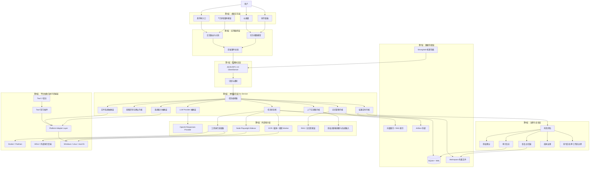
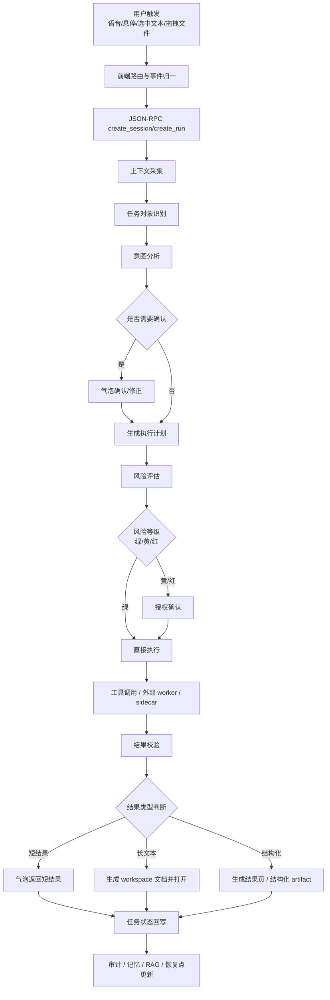
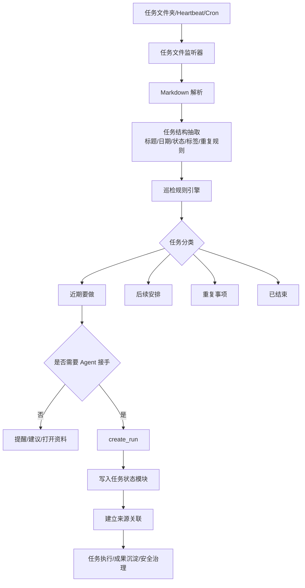
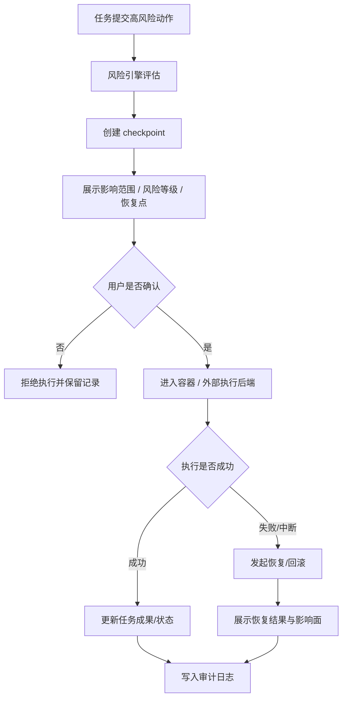
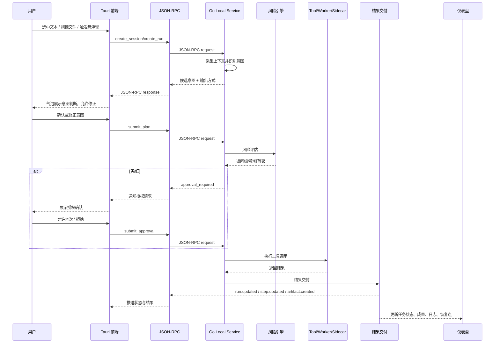
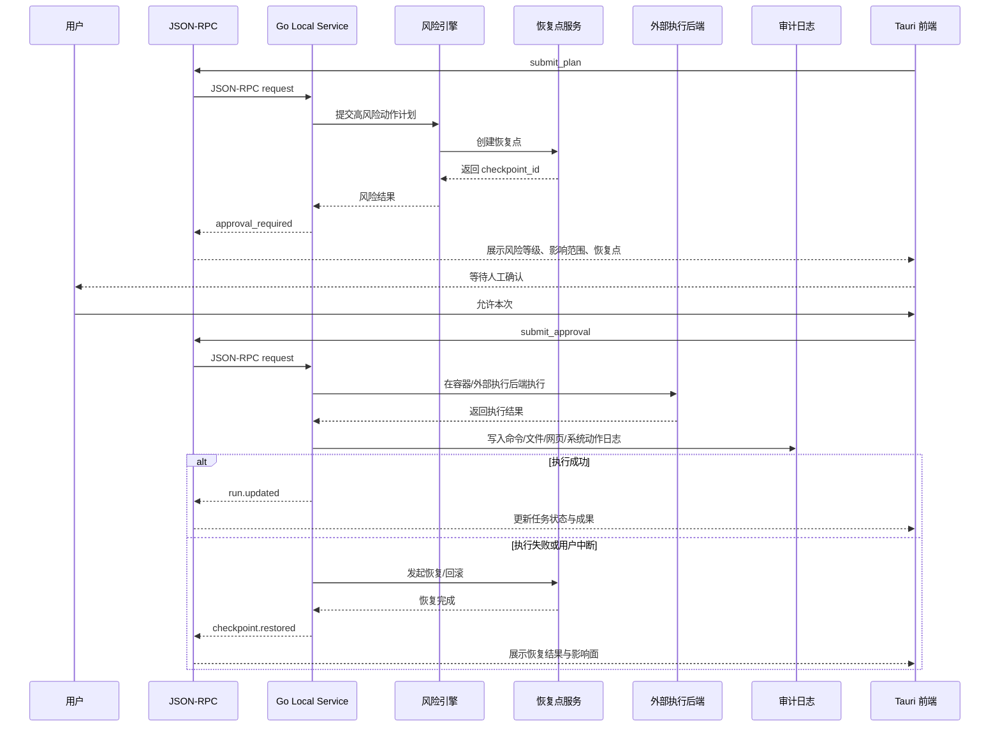

# CialloClaw 架构设计文档（修订版 v4）

## 1. 文档目的

本文档用于将 CialloClaw 的产品定义、交互规则、模块职责、治理要求、技术选型与协作方式，收敛为可实施的系统架构方案。

CialloClaw 的目标不是做一个以聊天框为中心的桌面 AI，而是做一个 **常驻桌面、低打扰、围绕任务现场承接协作、可确认执行、可恢复回滚** 的桌面协作 Agent。

产品主形态由以下部分组成：
- **悬浮球**：低打扰、就近发起。
- **轻量承接层**：在任务现场完成识别、确认、短反馈。
- **仪表盘工作台**：查看完整任务、成果、安全与记忆。
- **后台能力系统**：完成上下文采集、编排、工具调用、模型调用与治理。
- **操作面板**：系统级配置与策略控制。

CialloClaw 的产品定位可理解为：**面向桌面场景的轻量化桌面协作 Agent 包装应用**。在架构层级上，参考 PicoClaw 的轻量 Runtime 思路：强调单机运行、轻量编排、能力插件化、最短执行链路；但在产品形态上，CialloClaw 比 PicoClaw 更强调 **桌面交互承接、任务状态可视化、安全确认、恢复机制、跨平台抽象层**。

文档约束：
- 架构分层
- 技术栈边界
- 数据结构统一
- 命名统一
- AI 生成代码的接入方式
- P0 演示主链路优先级
- 跨平台抽象设计
- LLM / AI 服务接入抽象

---

## 2. 架构设计原则

### 2.1 总体原则
1. **桌面现场优先**：优先围绕当前页面、选中文本、拖入文件、错误信息、系统状态承接需求，而不是先让用户进入聊天页补上下文。
2. **轻量承接优先**：轻量对话、意图确认与即时结果优先由悬浮球附近的气泡和下方轻量操作区承接；只有需要完整状态或持续任务时才进入仪表盘。
3. **先提示、再确认、后执行**：尤其是改文件、发消息、系统动作、工作区外写入等场景，必须经过风险评估、授权确认、审计记录和恢复点保护。
4. **事件驱动、可恢复**：系统内部执行链路采用“观察—规划—执行—校验—持久化—恢复”的闭环，所有关键步骤进入事件流，并在关键边界保存 checkpoint。
5. **记忆与运行态分离**：长期经验记忆、阶段总结、画像，与任务运行时状态、审计日志、恢复点严格分层，避免数据混用。
6. **跨平台一致性**：Windows、Linux 与 macOS 共享同一套核心 Runtime、Agent 编排与数据模型；仅在桌面插件权限、操作系统能力、执行后端与授权模型上做平台适配。
7. **抽象先于平台细节**：文件系统、路径、进程、容器执行、屏幕采集、通知、快捷键、剪贴板等能力必须先定义抽象接口，再分别做平台实现。
8. **前后端解耦**：前端桌面壳与主业务后端进程解耦，UI 不直接绑定 Go 原生桌面壳。
9. **跨语言通信优先使用标准协议**：前后端统一使用 **JSON-RPC 2.0**，以降低 Go / TypeScript / Node worker 之间的接入成本。
10. **AI 受约束接入**：AI 编码工具只能在统一命名、统一目录、统一协议、统一模板下生成代码，不能绕开架构约束自由发挥。
11. **主链路优先**：所有人必须先服务 P0 闭环，不能直接从 PRD 按各自理解开写。
12. **模型接入先标准化**：当前只实现 OpenAI Responses API 标准，但必须通过 Provider 抽象层接入，避免未来切换模型时重写主链路。

### 2.2 不做原则
- 不做以终端为主入口的 Agent 壳。
- 不做以流程编排为中心的重平台。
- 不做默认静默执行高风险动作的强接管工具。
- 不把聊天窗口作为默认主入口。
- 不把桌面 UI 与业务后端强耦合成不可替换的大一体模块。
- 不让每个人按自己的 AI Prompt 风格各写一套结构。
- 不让所有人直接拿 PRD 开始实现。
- 不允许在未对齐命名、状态、数据结构之前进入大面积编码。
- 不允许代码里写死 Windows 盘符、反斜杠路径或平台专属行为作为主逻辑。

---

## 3. 总体架构设计

### 3.1 架构总览

CialloClaw 采用 **“桌面交互层 + 应用编排层 + 传输协议层 + 本地服务层 + 外部能力层 + 治理安全层 + 数据存储层 + 平台抽象与执行后端层”** 的分层架构。

### 3.2 层次划分说明

#### 第 1 层：桌面交互层
负责用户看得见、摸得着的界面承接：悬浮球、气泡、仪表盘、操作面板。

#### 第 2 层：应用编排层
负责把交互动作转成客户端任务：事件路由、任务分流、视图状态组织、前端协议转换。

#### 第 3 层：传输协议层
负责前后端以及 sidecar / worker 之间的统一通信规范。主协议统一采用 **JSON-RPC 2.0**，支持请求、响应、通知与订阅。

#### 第 4 层：本地服务层
由 Go 1.22+ sidecar / local service 承担，负责任务编排、上下文、状态机、记忆、交付与本地服务逻辑。

#### 第 5 层：外部能力层
负责把 LLM Provider、浏览器自动化、OCR、视频处理、媒体处理、RAG 检索、系统辅助能力作为独立能力接入。

#### 第 6 层：治理与安全层
负责风险评估、授权、审计、恢复点、预算、边界校验，是执行链路的强约束层。

#### 第 7 层：数据存储层
负责结构化状态、RAG 索引、工作区文件、大对象与机密存储。

#### 第 8 层：平台抽象与执行后端层
负责 Tauri 宿主、官方插件、平台抽象适配、跨平台分发与真正的外部执行后端（Docker / Podman / WSL2 等）。

### 3.3 跨平台原则（Windows / Linux / macOS）

CialloClaw 必须以 **Windows + Linux + macOS 三平台统一演进** 为前提设计：
- **共享部分**：React 前端、应用编排、JSON-RPC 协议、Go 本地服务、数据模型、事件协议、任务协议。
- **适配部分**：Tauri 能力权限、托盘、通知、快捷键、剪贴板、更新、屏幕捕获授权、文件系统实现、容器执行后端。
- **发布目标**：Windows 安装包；Linux 提供 deb、rpm、AppImage 或脚本安装方案；macOS 提供 .app / dmg / pkg。
- **能力降级**：若 Linux 桌面环境差异或 macOS 权限模型导致某些系统级能力不可完全对齐，应提供可感知的降级策略，而不是静默失效。
- **路径与文件系统约束**：
  - 不允许在业务代码中直接拼接平台路径分隔符。
  - 不允许在业务逻辑中写死 `C:\`、`D:\`、`/Users/...`、`/home/...`。
  - 所有路径必须通过 `FileSystemAdapter` 统一归一化。
  - 所有工作区访问必须以 workspace root 为边界。

### 3.4 平台抽象层设计（重点补充）

为保证跨平台扩展性，必须引入 **Platform Adapter Layer**。该层至少抽象以下接口：

- `FileSystemAdapter`
  - `Join(...)`
  - `Clean(path)`
  - `Abs(path)`
  - `Rel(base, target)`
  - `Normalize(path)`
  - `EnsureWithinWorkspace(path)`
  - `ReadFile(path)`
  - `WriteFile(path, content)`
  - `Move(src, dst)`
  - `MkdirAll(path)`

- `PathPolicy`
  - 屏蔽盘符差异
  - 屏蔽分隔符差异
  - 统一路径合法性校验
  - 统一 workspace 边界校验

- `OSCapabilityAdapter`
  - 托盘
  - 通知
  - 快捷键
  - 剪贴板
  - 屏幕授权
  - 外部命令启动
  - sidecar 生命周期

- `ExecutionBackendAdapter`
  - Docker
  - Podman
  - WSL2
  - Future Remote Backend

- `StorageAdapter`
  - SQLite
  - RAG 索引
  - Artifact 外置存储
  - Stronghold 机密存储

业务代码必须依赖接口，不得依赖平台特有路径或 API 名称。

---

## 4. 功能架构设计

## 4.1 入口与轻量承接架构

### 4.1.1 入口类型
悬浮球支持以下入口：
- 左键单击：轻量接近或承接当前对象。
- 左键双击：打开仪表盘。
- 左键长按：语音主入口，上滑锁定、下滑取消。
- 鼠标悬停：轻量输入 + 主动推荐。
- 文件拖拽：文件解析后进入意图确认。
- 文本选中：进入可操作提示态，再进入意图确认。

### 4.1.2 轻量承接层职责
轻量承接层不是聊天线程，而是任务现场的短链路承接层，负责：
- 识别任务对象
- 做意图分析
- 提供确认/修正
- 输出短结果或状态
- 决定是否分流到文档、结果页、任务详情

## 4.2 任务状态架构

任务状态模块负责承接“已经被 Agent 接手并正在推进的工作”。核心结构包括：
- **任务头部**：名称、来源、状态、开始时间、更新时间。
- **步骤时间线**：已完成、进行中、未开始。
- **关键上下文**：本轮任务使用的资料、记忆摘要、约束条件。
- **成果区**：草稿、文件、网页、模板、清单。
- **信任摘要**：风险状态、待授权数、恢复点、边界触发。
- **操作区**：暂停、继续、取消、修改、重启、查看安全详情。

## 4.3 便签协作 / 巡检架构

便签协作模块是“未来安排向执行任务转换”的中间层。分类结构：
- 近期要做
- 后续安排
- 重复事项
- 已结束事项

底层能力包括：
- 指定 `.md` 任务文件夹监听
- Markdown 任务项识别
- 日期、优先级、状态、标签提取
- 巡检频率、变更即巡检、启动时巡检
- 到期提醒、长时间未处理提醒
- 下一步动作建议、打开资料、生成草稿

## 4.4 镜子记忆架构

镜子模块不是聊天记录页，而是长期协作的认知层。分为三层：
1. **短期记忆**：支撑连续任务理解。
2. **长期记忆**：偏好、习惯、阶段性信息沉淀。
3. **镜子总结**：日报、阶段总结、用户画像显性展示。

设计约束：
- 默认本地存储，可一键开关
- 长期记忆与运行态恢复状态分离
- 用户可见、可管理、可删除
- 周期总结和画像更新受操作面板配置控制
- 长期记忆支持 **RAG 检索索引**，但写入与检索必须与运行态状态解耦

## 4.5 安全卫士架构

安全卫士是治理核心，负责：
- 工作区边界控制
- 风险分级
- 授权确认
- 影响范围展示
- 一键中断
- 恢复与回滚
- Token 与费用治理
- 审计日志
- 容器与外部执行后端的策略接入

风险模型采用绿/黄/红三级：
- **绿灯**：静默执行，仅记录。
- **黄灯**：执行前询问。
- **红灯**：必须人工确认。

## 4.6 操作面板架构

操作面板是系统配置中心，不承接任务，不替代仪表盘。主入口为托盘右键。信息架构分为：
- 通用设置
- 外观与桌面入口
- 记忆
- 任务与自动化
- 数据与日志
- 模型与密钥
- 关于

---

## 5. 核心实现逻辑图

## 5.1 主动输入闭环实现逻辑图

## 5.2 任务巡检转任务实现逻辑图

## 5.3 高风险执行与回滚闭环逻辑图

---

## 6. 关键时序图

## 6.1 文本选中 / 文件拖拽后的意图确认与执行时序图

## 6.2 高风险执行、授权、回滚时序图

---

## 7. 模块详细划分

## 7.1 桌面交互层模块
### 7.1.1 悬浮球控制器
- 拖拽、贴边、大小与透明度控制
- 单击/双击/长按/悬停/右键菜单路由
- 文本选中态、文件拖拽态、语音承接态、处理中态、完成态、异常态

### 7.1.2 气泡与轻量输入控制器
- 意图判断展示
- 用户确认/修正输入
- 短结果展示
- 下一步动作建议
- 生命周期控制：淡出、恢复、置顶、关闭

### 7.1.3 仪表盘控制器
- 首页意识场
- 任务状态
- 便签协作
- 镜子模块
- 安全卫士
- 快捷键

### 7.1.4 操作面板控制器
- 设置项配置
- 行为开关
- 记忆策略
- 自动化规则
- 成本与数据治理
- 密钥与模型配置

## 7.2 应用编排层模块
### 7.2.1 交互路由器
- 不同入口类型统一路由
- 页面间跳转与分流
- 轻量承接与仪表盘切换策略

### 7.2.2 任务视图模型层
- UI 状态归一化
- 任务列表/详情映射
- 风险状态、步骤状态、成果状态的展示模型

### 7.2.3 客户端事件总线
- 前端事件派发
- 与 JSON-RPC 的订阅、通知桥接
- 将 session / run / step / event / tool_call / citation / artifact 统一映射到前端状态

## 7.3 传输协议层模块（JSON-RPC）
### 7.3.1 统一通信协议
- 前后端统一使用 **JSON-RPC 2.0**
- 请求 / 响应：命令式方法调用
- Notification：单向事件通知
- Subscription：运行态流式更新

### 7.3.2 协议职责
- `create_session`
- `create_run`
- `get_run`
- `subscribe_run`
- `submit_plan`
- `submit_approval`
- `cancel_run`
- `retry_run`
- `list_artifacts`
- `get_audit`
- `list_memory_hits`

### 7.3.3 统一协议优势
- 跨语言：Go / TypeScript / Node 之间接入成本低
- 结构稳定：更适合 AI 生成代码时遵循固定 schema
- 可扩展：便于后续接更多 Provider / worker / remote backend

## 7.4 本地服务层模块（Go Service）
### 7.4.1 JSON-RPC Server
- run/session 创建与销毁
- 实时状态推送
- 工具调用、任务更新、artifact 发布
- 订阅与通知管理

### 7.4.2 任务编排内核
- 任务创建
- 子步骤拆解
- 状态迁移
- 执行重试
- 人工确认转移
- 事件写入

### 7.4.3 上下文采集内核
- 当前窗口上下文
- 选中文本
- 拖入文件
- 用户授权的屏幕媒体输入
- 剪贴板
- 任务文件变化

### 7.4.4 记忆管理内核
- 短期记忆维护
- 长期偏好存储
- 阶段总结
- 任务与记忆引用关系管理
- 记忆写入与 RAG 检索协调

### 7.4.5 结果交付内核
- 短结果回写气泡
- 长结果生成文档/文件
- 结构化结果写入 workspace
- artifact 与 citation 发布

### 7.4.6 文件系统抽象层
- 路径归一化
- Workspace 边界校验
- 跨平台路径读写
- Artifact 文件落盘
- 不暴露平台专属路径实现

### 7.4.7 LLM Provider 抽象层
- 当前只接 OpenAI Responses 标准
- 未来支持更多 Provider
- 对上暴露统一接口：
  - `GenerateIntent`
  - `GenerateReply`
  - `ClassifyMemory`
  - `ExtractReminderIntent`
  - `ExtractTimePhrase`
  - `ProduceActionTags`

## 7.5 外部能力层模块
### 7.5.1 模型网关（当前只接 Responses 标准）
- LLM：意图识别、总结、改写、问答
- 多模型路由与成本控制（抽象保留，当前实现只用 Responses 标准）
- 模型调用审计与预算
- Function calling 与工具结果回填

### 7.5.2 工具执行适配器
- 文件读写
- 网页浏览与搜索
- 命令执行
- Workspace 内构建、测试、补丁生成
- 外部执行后端路由

### 7.5.3 Node Playwright Sidecar
- 浏览器自动化
- 表单填写与页面操作
- 网页抓取
- 结构化 DOM/页面结果回传

### 7.5.4 OCR / 媒体 / 视频 Worker
- Tesseract OCR
- FFmpeg 转码与抽帧
- yt-dlp 下载与元数据提取
- MediaRecorder 结果后处理

### 7.5.5 授权式屏幕 / 视频能力
- `getDisplayMedia` 发起用户授权捕获
- `MediaRecorder` 负责录制
- 本地 worker 做切片、转码、OCR 与摘要

### 7.5.6 RAG / 记忆检索层
- 记忆向量化
- 记忆候选召回
- 记忆去重
- 记忆排序
- 记忆回填摘要
- 结构化状态与语义检索解耦

## 7.6 治理与安全层模块
### 7.6.1 风险评估引擎
输入维度：
- 动作类型
- 目标范围
- 是否跨工作区
- 是否可逆
- 是否涉及凭据/金钱/身份
- 是否需要联网/下载/安装
- 是否需要容器执行

### 7.6.2 审计与追踪引擎
- 文件操作记录
- 网页操作记录
- 命令操作记录
- 系统动作记录
- 错误日志
- Token 日志
- 费用日志

### 7.6.3 恢复与回滚引擎
- 任务工作区级回滚
- checkpoint 恢复
- diff/sync plan 展示
- 容器执行失败后的恢复策略

### 7.6.4 成本治理引擎
- 输入/输出 Token 统计
- 模型路由策略抽象
- 降级执行
- 熔断与预算提醒

### 7.6.5 边界与策略引擎
- workspace 前缀校验
- 命令白名单
- 网络代理与外连策略
- sidecar / worker 权限边界

---

## 8. 数据架构设计

## 8.1 数据分层
1. **结构化运行态数据库（SQLite + WAL）**  
   存任务状态、步骤、待确认动作、授权结果、成本统计、事件索引。

2. **记忆检索与 RAG 索引层**  
   用于长期记忆、摘要、向量召回、候选过滤。可采用 SQLite 兼容向量扩展或可替换索引实现，但必须通过抽象接口接入。

3. **工作区文件系统（Workspace）**  
   存生成文档、草稿、报告、导出文件、补丁、模板。

4. **大对象存储区（Artifact）**  
   截图、录屏、可访问性树、音频、视频临时产物、关键帧，不直接塞进主状态库。

5. **机密与敏感配置区（Stronghold）**  
   密钥、模型凭证、访问令牌、敏感配置。

## 8.2 核心实体
- Session
- Run
- Step
- Event
- ToolCall
- Citation
- Artifact
- AgentProfile
- ContextSnapshot
- TodoItem
- RecurrenceRule
- MemorySummary
- UserProfileMemory
- MemoryCandidate
- RetrievalHit
- RiskDecision
- ApprovalRecord
- AuditLog
- Checkpoint
- TokenUsageRecord

## 8.3 关键关系
- Session 拥有多个 Run。
- Run 拥有多个 Step、Event、ToolCall、Artifact、ApprovalRecord、Checkpoint。
- TodoItem 进入执行后生成 Run，并保留 source_todo_id。
- MemorySummary、MemoryCandidate、RetrievalHit 与 Run 通过引用关系关联，不混存原始运行态。
- AuditLog 与 Run/Step/Action 强绑定，支持回放和追责。
- Citation 与 Artifact 可以附着到 Step、Event 或最终交付结果。
- AgentProfile 决定默认模型、工具开关、预算与安全策略。

## 8.4 核心实体简要说明
- **Session**：一次会话级任务容器，聚合多个 run 的上下文与状态。
- **Run**：一次实际执行过程的主实体，描述任务名称、来源、状态、优先级、时间戳与整体结果。
- **Step**：Run 的子步骤实体，用于表示拆解后的执行步骤、顺序关系、状态变化与阶段结果。
- **Event**：状态与执行事件实体，用于驱动前端实时展示与审计。
- **ToolCall**：工具调用实体，记录调用目标、输入、输出、耗时、错误与权限信息。
- **Citation**：引用实体，记录回答或结果中关联的来源片段、文件、网页或上下文依据。
- **Artifact**：任务产物实体，表示生成的文档、截图、结构化结果、导出文件或中间产物。
- **AgentProfile**：Agent 的本地运行配置与能力画像，记录默认模型、工具开关、预算与策略边界。
- **ContextSnapshot**：某一次任务触发时采集到的上下文快照，包含窗口、选中文本、文件、截图、系统状态等输入。
- **TodoItem**：待办 / 巡检来源项，表示尚未正式进入执行态的事项，可被转化为 Run。
- **RecurrenceRule**：重复规则实体，描述巡检或重复任务的周期、触发条件与提醒规则。
- **MemorySummary**：任务或阶段总结后的记忆摘要，用于后续检索、复用与上下文压缩。
- **MemoryCandidate**：记忆候选实体，用于表示召回后待过滤、待排序的记忆片段。
- **RetrievalHit**：RAG 检索命中实体，表示本次任务命中的记忆索引结果及分数。
- **UserProfileMemory**：用户长期偏好与协作画像实体，用于保存偏好、习惯、工作方式等长期记忆。
- **RiskDecision**：风险评估结果实体，记录本次动作的风险等级、命中规则、影响范围与建议处理方式。
- **ApprovalRecord**：授权记录实体，保存用户对高风险动作的确认、拒绝、授权范围与时间。
- **AuditLog**：审计日志实体，记录文件、网页、命令、系统动作等关键行为，便于追踪与回放。
- **Checkpoint**：恢复点实体，表示任务执行前后的可回滚节点，用于失败恢复与用户中断回退。
- **TokenUsageRecord**：模型调用计量实体，记录输入/输出 Token、模型类型、成本与时间，用于预算治理。

---

## 9. 技术选型（统一版）

## 9.1 总体技术栈

### 桌面壳与前端
- **桌面壳：Tauri 2**
- **前端框架：React 18**
- **语言：TypeScript**
- **构建工具：Vite**

### 主业务后端
- **Go 1.22+ sidecar / local service**

### 前后端通信
- **JSON-RPC 2.0**
- 传输层可跑在 localhost HTTP / WebSocket 之上
- Notification / Subscription 用于实时状态更新
- 前端应用资源继续走 Tauri 默认应用协议，不使用 localhost 托管整个 UI

### 桌面公共能力
- **Tauri 官方插件**
  - Tray
  - Notification
  - Global Shortcut
  - Clipboard
  - Updater

### 结构化存储
- **SQLite + WAL**
- **数据库连接由 Go service 持有**

### 记忆与检索
- **RAG（语义检索层）**
- 支持长期记忆召回、候选过滤、摘要回填
- 通过抽象接口挂到 Memory 层，避免和结构化运行态耦合

### 密钥与敏感配置
- **Tauri Stronghold**

### 浏览器自动化
- **Node.js sidecar + 官方 Playwright**

### 屏幕 / 视频能力
- **getDisplayMedia + MediaRecorder + FFmpeg + yt-dlp + Tesseract**

### 插件系统
- **gRPC / stdio / HTTP 外部 worker 协议**

### LLM / AI 服务
- **当前只实现 OpenAI Responses API 标准**
- 通过 Provider 抽象层接入，保留跨模型兼容扩展能力

### 沙盒与执行隔离
- **Docker / Podman / WSL2 / 外部执行后端**
- **宿主只负责 workspace 边界校验、命令白名单、网络代理与策略控制**

### 安装与分发
- **Windows**：Tauri 打包安装程序
- **Linux**：deb / rpm / AppImage
- **macOS**：.app / dmg / pkg

## 9.2 关键替换关系

- **HTTP REST + 自定义流协议 → JSON-RPC 2.0**
- **Wails → Tauri 2**
- **systray / beeep / x/hotkey / clipboard 桥接 → Tauri 官方插件**
- **Go 原生桌面壳 → Go sidecar / local service**
- **go-plugin → gRPC / stdio / HTTP 外部 worker**
- **go-keyring / DPAPI 主路径 → Tauri Stronghold**
- **Go 原生桌面屏幕桥接 → 授权式 getDisplayMedia + MediaRecorder + 外部 worker**
- **Windows 原生轻沙盒 → 容器沙盒 / 外部执行后端**

## 9.3 选型理由

### 9.3.1 JSON-RPC 2.0
这套协议更适合当前 CialloClaw 的跨语言架构：
- Go / TypeScript / Node 之间接入成本低
- 请求、响应、通知、订阅结构统一
- 更适合 AI 编码时代的统一 schema 驱动开发
- 便于 sidecar / worker 与主服务保持同一协议风格

### 9.3.2 Tauri 2 + React 18 + TypeScript + Vite
这套组合更符合“跨平台桌面壳 + 静态前端 + Web UI 复杂交互 + 本地 sidecar”的目标：
- React 18 适合悬浮球、气泡、仪表盘、操作面板等多视图协同
- TypeScript 有利于统一任务状态、事件协议、结果结构
- Vite 启动快、构建快
- Tauri 适合承载静态前端，不要求把业务后端和桌面壳绑在一起

### 9.3.3 Go 1.22+ sidecar / local service
Go 继续负责任务编排、状态机、SQLite、worker 调度、审计和恢复，但不再直接承担桌面壳职责。这样可以保留 Go 在本地服务与高并发调度上的优势，同时避免 UI 技术路线被 Go 原生桌面壳绑定。

### 9.3.4 SQLite + WAL + RAG
- **SQLite** 负责结构化运行态、事务和审计
- **RAG 层** 负责长期记忆与语义检索
- 两者分工清晰，既保证工程稳定，又保证记忆检索可扩展

### 9.3.5 Stronghold
密钥、模型 Token、敏感配置由 Tauri Stronghold 管理，避免把敏感信息直接散落在本地明文文件或业务数据库里。

### 9.3.6 Node Playwright Sidecar
浏览器自动化不再走 Go 原生封装主路径，而是使用 Playwright 官方支持最成熟的 Node / TypeScript 路线，更适合复杂网页自动化和长期维护。

### 9.3.7 OpenAI Responses Provider 抽象
当前只实现 OpenAI Responses API 标准：
- 统一输入输出结构
- 支持 tool calling
- 支持多轮状态关联
- 更适合当前 Agent 场景

但在代码结构上必须通过 Provider 抽象层接入，以便未来接入其他模型时不重写上层业务。

### 9.3.8 外部 worker 协议
OCR、浏览器自动化、媒体处理、敏感系统能力都做成独立进程，通过 gRPC / stdio / HTTP 协议接入。这样语言无关、隔离性更强，也更利于 AI 生成代码后的独立验证。

### 9.3.9 容器优先沙盒
宿主只负责轻治理，真正的强隔离交给 Docker / Podman / WSL2 等外部执行后端，更符合跨平台可维护性要求。

## 9.4 明确不建议的技术路线
- 不采用 Wails 作为桌面壳主路线
- 不采用 Go 原生桌面插件桥接作为公共能力主路线
- 不把整个前端 UI 用 localhost 托管
- 不把 go-plugin 继续作为核心插件体系
- 不把屏幕感知主链路建立在 Win32 原生桥接上
- 不把 Windows 原生轻沙盒作为核心隔离能力
- 不让任何成员自己定义一套“AI 生成出来就算数”的目录和命名
- 不让模型接入直接散落在业务逻辑中

---

## 10. 执行隔离与部署架构

## 10.1 执行隔离分层
### 10.1.1 宿主治理层
适用于：
- workspace 边界校验
- 命令白名单
- 网络代理
- sidecar / worker 启停
- 风险提示与授权确认

### 10.1.2 外部执行后端层
适用于真正高风险任务：
- Docker
- Podman
- WSL2
- 未来可扩展的远程执行后端

## 10.2 跨平台部署原则
- 安装后即可使用基础能力，不强依赖 Docker，但高风险能力优先接入容器执行后端。
- 前端资源使用 Tauri 默认应用协议。
- Go service 作为 sidecar 随应用一起分发。
- Node Playwright sidecar 与媒体 worker 独立分发和升级。
- Updater 必须使用签名校验的更新链路。

---

## 11. 可观测与成本治理

## 11.1 观测指标
应把以下做成一等指标：
- 每次调用输入/输出 Token
- 各上下文块占比
- 哪类工具导致膨胀
- 哪类任务单位成本最高
- 摘要压缩节省率
- 缓存命中率
- 降级触发率
- 重试率
- worker / sidecar 失败率
- 容器执行成功率
- RAG 命中率
- 记忆候选过滤命中率

## 11.2 成本控制策略
- 上下文预算前置分配
- 历史上下文采用摘要继承，不滚动原文
- 工具结果默认回填摘要而不是全文
- 小模型 / 规则预处理，大模型做推理和生成
- 输出长度预算
- 长任务阶段性压缩
- 触发成本熔断与自动降级

---

## 12. 非功能设计

### 12.1 性能
- 悬浮球常驻必须轻量
- 主动协助默认低频、不强弹窗
- 大对象不进主状态库
- 高频状态变化用事件总线与增量更新
- 三平台核心交互延迟体验保持一致

### 12.2 可靠性
- 关键步骤 checkpoint
- 原子写入
- workspace 内临时文件 + rename
- 执行中断后可见已完成 / 未完成 / 可恢复 / 需回滚状态
- sidecar / worker 崩溃后可重连、可回收、可降级

### 12.3 安全性
- workspace prefix check
- 工作区越界阻断
- 高风险动作必须确认
- 容器执行优先
- 审计全链路留痕
- 插件权限显式授权
- 更新包签名校验

---

## 13. 结论

CialloClaw 的正确架构方向，不是“Go 原生桌面壳 + 一堆工具”，而是：

**Tauri 2 桌面宿主 + React 18 前端 + JSON-RPC 2.0 + Go 本地服务 + OpenAI Responses Provider 抽象 + SQLite + RAG + Stronghold + 外部 worker / sidecar + 容器优先执行后端 + 严格协作规范 + 跨平台抽象层**。

因此，CialloClaw 更适合被定义为：

**一个以 Tauri 2 为桌面宿主、以 React 18 + TypeScript + Vite 为前端、以 Go 1.22+ local service 为主业务后端、以 JSON-RPC 2.0 为统一通信协议、以 SQLite + RAG 为数据基础、面向 Windows / Linux / macOS 的轻量桌面协作 Agent。**
