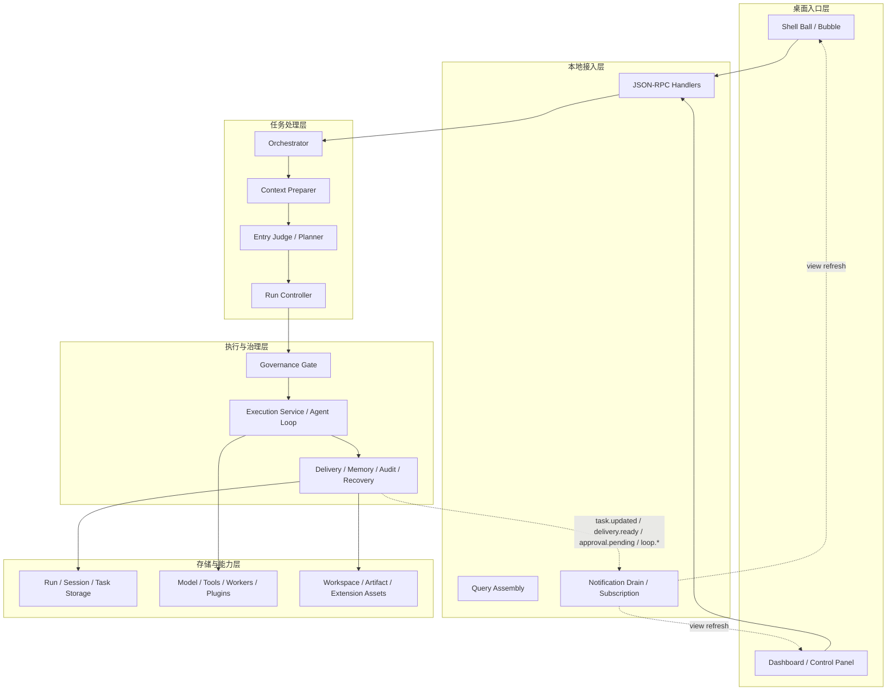

# CialloClaw 架构总览文档（v16）

## 1. 文档范围

本文档只描述当前仓库中已经存在的系统结构、主链路、模块职责、层间边界与中间产物。

本文档不承担以下内容：

- 工程规范、提交流程、协作约束
- 过细的产品交互说明
- 单个页面的视觉设计与文案
- 未来版本假设性的扩展方案

需要查看协议、数据、模块细节时，分别以 `docs/protocol-design.md`、`docs/data-design.md`、`docs/module-design.md` 为准。

---

## 2. 架构总原则

CialloClaw 当前架构遵循以下稳定原则：

1. 对外主对象始终是 `task`。
2. 对内执行兼容对象保留 `run / step / event / tool_call`。
3. 前后端唯一稳定边界是 JSON-RPC 2.0。
4. 正式结果出口统一收敛到 `delivery_result / artifact / citation`。
5. 风险动作必须进入授权、审计、恢复点链路。
6. 记忆、运行态、Trace/Eval 严格分层，不互相充当真源。

这意味着系统不是“一个自由聊天机器人加若干工具”，而是“一个由 Go 服务按固定工作流编排、由模型参与局部判断和执行的 task-centric 本地协作系统”。

---

## 3. 分层结构

### 3.1 各层职责

| 层 | 主要实现锚点 | 主要职责 | 不负责什么 |
| --- | --- | --- | --- |
| 桌面入口层 | `apps/desktop/src/features/*` | 承接悬浮球、气泡、仪表盘、控制面板交互 | 不直接访问数据库、模型、worker |
| 本地接入层 | `services/local-service/internal/rpc/*` | 方法注册、参数校验、查询装配、通知回流 | 不做任务规划、不维护业务状态机 |
| 任务处理层 | `internal/orchestrator`、`internal/context`、`internal/intent`、`internal/runengine` | 把输入变成正式任务并推进状态 | 不直接越过治理层把底层结果返回前端 |
| 执行与治理层 | `internal/execution`、`internal/agentloop`、`internal/delivery`、`internal/risk`、`internal/audit`、`internal/checkpoint`、`internal/memory` | 风险判断、执行、交付、审计、恢复、记忆回写 | 不发明新的对外主对象 |
| 存储与能力层 | `internal/storage`、`internal/model`、`internal/tools`、`internal/plugin`、`workers/*` | 持久化、模型/工具/worker/插件接入、artifact 与扩展资产治理 | 不决定产品语义，不编排 task 主链 |

### 3.2 主链路

当前主链路可以概括为：

`桌面输入 -> JSON-RPC -> context 捕获 -> continuation/session 判定 -> intent 判断 -> task 创建或续挂 -> governance -> execution -> delivery/memory/audit/recovery -> notification/query -> 前端展示`

---

## 4. 任务处理层详解

这一层是本文档的重点，因为它决定了系统到底是“谁在编排、怎么判断、怎么承接”。

### 4.1 谁来编排

当前真正的编排者是 `services/local-service/internal/orchestrator/service.go` 中的 `orchestrator.Service`，不是模型本身。

模型只在受限位置参与：

1. `task_continuation.go` 中的连续输入分类。
2. `execution.Service` 中的内容生成或工具规划。
3. `agentloop.Runtime` 中的 ReAct 风格 planner/tool loop。

因此，系统不是“让 AI 自由决定整个工作流”，而是：

- **工作流顺序由 Go 代码预设**
- **模型只负责局部判断或局部规划**
- **任务状态推进和治理边界由 runengine 与 orchestrator 固定控制**

### 4.2 上下文准备器

上下文准备器对应 `services/local-service/internal/context/service.go` 的 `context.Service.Capture`。

它的输入来自 JSON-RPC 请求中的两个区域：

- `input.*`
- `context.*`

它会把分散字段折叠成统一的 `TaskContextSnapshot`，这是任务处理层第一个正式中间产物。

#### 4.2.1 `TaskContextSnapshot` 的上下文范围

当前快照包含以下上下文类型：

- 输入来源：`source`、`trigger`、`input_type`、`input_mode`
- 用户文本：`text`
- 选中文本：`selection_text`
- 错误文本：`error_text`
- 文件输入：`files`
- 页面上下文：`page_title`、`page_url`
- 应用/窗口上下文：`app_name`、`window_title`
- 可见屏幕信息：`visible_text`、`screen_summary`
- 辅助行为信号：`clipboard_text`、`hover_target`、`last_action`
- 行为计数：`dwell_millis`、`copy_count`、`window_switches`、`page_switches`

这里的“上下文”不是单一 prompt 文本，而是任务判断和执行都要消费的一份结构化现场快照。

#### 4.2.2 上下文准备后的第一批中间产物

| 产物 | 生产者 | 用途 |
| --- | --- | --- |
| `TaskContextSnapshot` | `context.Service.Capture` | 统一输入现场，供 continuation、intent、execution 消费 |
| `taskContinuationContext` | `orchestrator.resolveTaskContinuationContext` | 限定当前输入应该与哪个 hidden session 的未完成任务比较 |
| `taskContinuationDecision` | classifier / fallback heuristic | 决定续挂已有 task 还是新建 task |

### 4.3 入口判断与规划器

入口判断与规划器主要由 `internal/intent/service.go` 提供，外层由 orchestrator 负责调用顺序。

它做的不是完整执行计划，而是**入口级判断**：

1. 当前输入是否根本缺信息。
2. 是否需要 `confirming_intent`。
3. 若可直接进入主链，应给出一个最小可执行建议。

其核心输出是 `Suggestion`，字段包括：

- `Intent`
- `IntentConfirmed`
- `TaskTitle`
- `TaskSourceType`
- `RequiresConfirm`
- `DirectDeliveryType`
- `ResultPreview`
- `ResultTitle`
- `ResultBubbleText`

这一步是“入口判断与规划骨架”，不是完整执行编排。它只产出后续状态机和 execution 需要的最小决策。

#### 4.3.1 判断逻辑的当前形态

当前判断逻辑以确定性规则为主：

- `AnalyzeSnapshot` 只区分 `waiting_input` 与 `confirming_intent`
- `Suggest` 负责默认 intent、标题、source_type、是否确认、默认交付方式
- `screen_analyze` 等特殊输入在 orchestrator 中有专门分支

也就是说，当前“入口判断与规划器”不是一个通用 LLM planner，而是：

- **先用规则做入口路由**
- **把复杂规划延后到 execution/agent loop**

### 4.4 运行控制器

运行控制器对应 `services/local-service/internal/runengine/engine.go` 的 `runengine.Engine`。

它是当前系统里唯一维护正式任务运行态的状态机。

#### 4.4.1 它接收什么

运行控制器接收的是前一步已经整理好的结构化输入，而不是原始 RPC 请求。

核心输入包括：

- `CreateTaskInput`
- `ContinuationUpdate`
- governance 相关的 `approval_request` / `pending_execution`
- post-delivery 的 memory / artifact / storage plans

#### 4.4.2 它产出什么

运行控制器最核心的正式运行态对象是 `TaskRecord`，它把外部 `task` 与内部 `run` 绑定在一起。

`TaskRecord` 当前包含：

- 身份字段：`task_id`、`session_id`、`run_id`
- 入口与状态：`title`、`source_type`、`status`、`current_step`
- 运行语义：`intent`、`execution_attempt`、`loop_stop_reason`
- 现场快照：`snapshot`
- 时间线：`timeline`、`current_step_status`
- 展示出口：`bubble_message`、`delivery_result`、`artifacts`、`citations`
- 治理对象：`approval_request`、`authorization`、`impact_scope`、`security_summary`
- 观测与回写：`latest_event`、`latest_tool_call`、`notifications`
- 后处理计划：`memory_read_plans`、`memory_write_plans`、`storage_write_plan`、`artifact_plans`

#### 4.4.3 它怎么承接前一步产物

运行控制器的关键方法说明了“中间产物如何继续流动”：

| 方法 | 上游输入 | 下游结果 |
| --- | --- | --- |
| `CreateTask` | `CreateTaskInput` | 创建 `TaskRecord`、`run_id`、初始 `timeline` |
| `BeginExecution` | task 已确认、准备执行 | 进入 `processing` 并推进时间线 |
| `ContinueTask` | `ContinuationUpdate` | 续挂 steering、合并 snapshot、更新时间线 |
| `MarkWaitingApprovalWithPlan` | governance 结果 | 把 task 切到 `waiting_auth` 并保存 `approval_request` / `pending_execution` |
| `QueueTaskForSession` | session 已有活跃任务 | 把 task 挂到 `session_queue` |
| `ResumeQueuedTask` | 前序任务完成 | 恢复排队 task 继续执行 |
| `CompleteTask` | execution / delivery 已完成 | 进入完成态并挂上交付结果 |

运行控制器**不决定计划内容**，只保证计划被结构化承接、持久化和通知化。

---

## 5. 执行与治理层详解

### 5.1 风险治理谁负责

风险治理由 orchestrator 先触发，再由 `execution.Service.AssessGovernance` 和相关治理模块收口。

主链路里的关键入口是：

- `handleTaskGovernanceDecision`
- `assessTaskGovernance`
- `buildPendingExecution`
- `buildApprovalRequest`

治理阶段的关键中间产物包括：

- `GovernanceAssessment`
- `approval_request`
- `pending_execution`
- `authorization_record`
- `audit_record`
- `recovery_point`

如果治理要求授权，任务不会直接进入执行，而是先被 runengine 挂到 `waiting_auth`。

### 5.2 execution 谁来跑

真正的执行入口是 `services/local-service/internal/execution/service.go` 的 `execution.Service.Execute`。

它当前是一个**固定顺序的执行路由器**，不是自由编排器。

执行时会把 orchestrator 的运行态输入折叠为 `execution.Request`，其中包括：

- `TaskID` / `RunID`
- `Intent`
- `AttemptIndex` / `SegmentKind`
- `Snapshot`
- `SteeringMessages`
- `DeliveryType`
- `ResultTitle`
- 授权与预算相关字段

然后按固定顺序选择执行路径：

1. 屏幕分析内建路径
2. 直接 builtin tool 路径
3. 生成输出路径
4. `agent_loop` 时进入 `agentloop.Runtime`

执行输出统一收敛成 `execution.Result`，再由 orchestrator 回写 runengine。

### 5.3 task 编排是 AI 还是预设工作流

答案是：**整体编排是预设工作流，局部决策由 AI 参与**。

具体分工如下：

| 层级 | 是否由 AI 主导 | 当前实现 |
| --- | --- | --- |
| 请求承接与 session/task 路由 | 否 | `orchestrator.Service` 固定流程 |
| 上下文归一化 | 否 | `context.Service.Capture` 规则归一化 |
| 入口判断与最小计划骨架 | 主要否 | `intent.Service` 规则判断 |
| follow-up 是否续挂同 task | 可选 AI | `task_continuation.go` classifier + heuristic fallback |
| agent loop 中的工具选择与步骤推进 | 是，但受控 | `agentloop.Runtime` 调用模型 planner |
| 最终状态推进、授权、交付、持久化 | 否 | `runengine` + `orchestrator` + `delivery` |

因此，AI 不是系统总调度器，而是嵌入在固定后端工作流中的受控子决策器。

### 5.4 Agent Loop 的内部处理细节

`services/local-service/internal/agentloop/runtime.go` 定义了当前受控 ReAct 执行循环。

#### 5.4.1 固定流程

当前 loop 的固定流程是：

1. 读入 `execution.Request`
2. 吸收新的 steering messages
3. 构造 planner input
4. 调用模型生成 tool calls / output
5. 记录 round、event、tool_call
6. 必要时重试 planner 或 tool
7. 命中 stop reason 后返回结构化结果

#### 5.4.2 loop 的中间产物

| 中间产物 | 说明 |
| --- | --- |
| `PersistedRound` | 每一轮 loop 的结构化 step 快照 |
| `LifecycleEvent` | `loop.started`、`loop.round.started`、`loop.failed` 等事件 |
| `DeliveryRecord` | loop 内部生成的 delivery 快照 |
| `StopReason` | 为什么结束：完成、需授权、需补充输入、planner error、dead loop 等 |
| `Result` | loop 运行总结果，包含 output、tool_calls、events、rounds、delivery、compacted_history |

这些中间产物不会直接裸露给前端，而是先进入 orchestrator，再映射到：

- `task.updated`
- `delivery.ready`
- `task detail timeline`
- `tool_call / event / delivery_result / citation`

---

## 6. 交付、记忆与观测回写

执行完成后，orchestrator 还会做一层正式回写。

### 6.1 正式交付

正式交付由 `delivery.Service` 统一构建，最终对外只暴露：

- `delivery_result`
- `artifact`
- `citation`

其中：

- `delivery_result` 是正式结果入口
- `artifact` 是落盘或可打开对象
- `citation` 是证据链引用

### 6.2 记忆与交付后计划

当前并不是执行时直接写长期记忆，而是先在 runengine 上登记计划：

- `attachMemoryReadPlans`
- `attachPostDeliveryHandoffs`
- `SetMemoryPlans`
- `SetDeliveryPlans`

这一步的意义是：把“任务执行”和“后续沉淀/落盘”拆开，避免把记忆层和交付层混进主执行状态机。

### 6.3 审计、恢复与 Trace/Eval

审计、恢复点、trace/eval 都是执行后的正式回流对象，不是前端局部态。

当前主链上已经存在：

- `audit_record`
- `recovery_point`
- `traceeval.CaptureResult`

它们用于：

- 风险动作可追踪
- 执行失败可恢复
- loop/tool/model 行为可观测

---

## 7. 关键中间产物总表

| 阶段 | 中间产物 | 生产者 | 传给谁 |
| --- | --- | --- | --- |
| 请求归一化 | `TaskContextSnapshot` | `context.Service` | continuation、intent、execution |
| session 路由 | `taskContinuationContext` | `orchestrator` | continuation classifier / fallback |
| follow-up 判定 | `taskContinuationDecision` | classifier / heuristic | orchestrator |
| 入口计划骨架 | `Suggestion` | `intent.Service` | runengine、delivery、governance |
| 运行态初始化 | `CreateTaskInput` | orchestrator | `runengine.CreateTask` |
| 正式运行态 | `TaskRecord` | `runengine.Engine` | query、notification、execution、governance |
| 治理决策 | `GovernanceAssessment` | `execution.Service` / orchestrator fallback | approval / block / execute |
| 执行请求 | `execution.Request` | orchestrator | `execution.Service.Execute` |
| loop 轮次快照 | `PersistedRound` | `agentloop.Runtime` | trace/query/runtime event |
| loop 生命周期事件 | `LifecycleEvent` | `agentloop.Runtime` | notification / runtime event view |
| 执行结果 | `execution.Result` | `execution.Service` | orchestrator / runengine |
| 正式交付 | `delivery_result / artifact / citation` | delivery + orchestrator | task detail / open action / dashboard |
| 后处理计划 | `memory_*_plans`、`storage_write_plan`、`artifact_plans` | orchestrator | runengine / storage / memory |

---

## 8. 当前边界结论

1. 当前系统的总体编排者是 `orchestrator.Service`，不是 AI。
2. “上下文准备器 -> 入口判断与规划器 -> 运行控制器”已经分别落在 `context`、`intent`、`runengine`，外层由 orchestrator 固定串接。
3. 当前“规划器”只产出最小执行骨架，不直接产出完整工作流；完整执行规划在 `execution` 和 `agentloop` 内继续展开。
4. `runengine.Engine` 才是正式任务状态机真源；前端和 worker 都不能自持 task 状态。
5. 模型只在受控子步骤中参与，不负责决定系统整体结构与治理边界。
6. `delivery_result / artifact / citation` 是正式出口；`approval_request / authorization_record / audit_record / recovery_point` 是正式治理出口。

这就是当前仓库中已经落地的架构真实形态。
