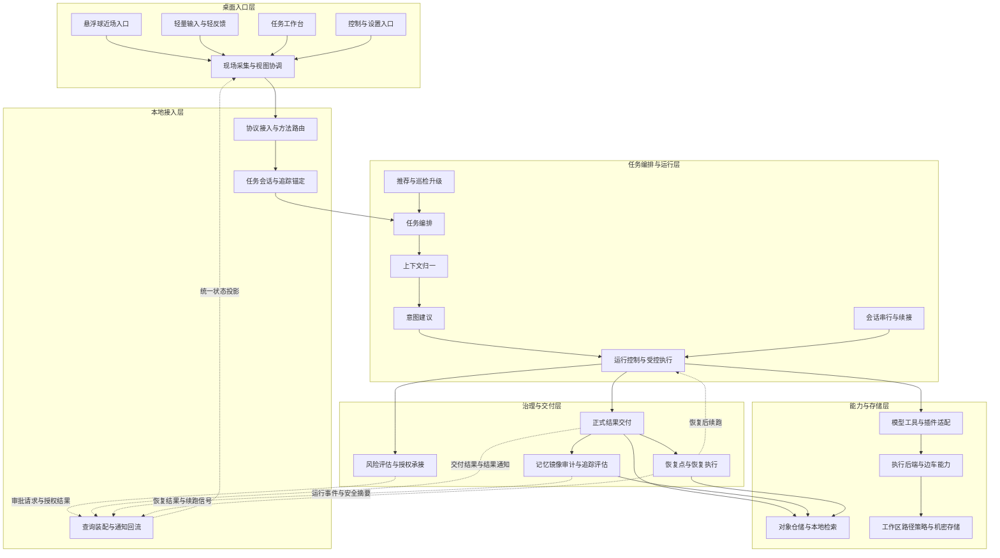
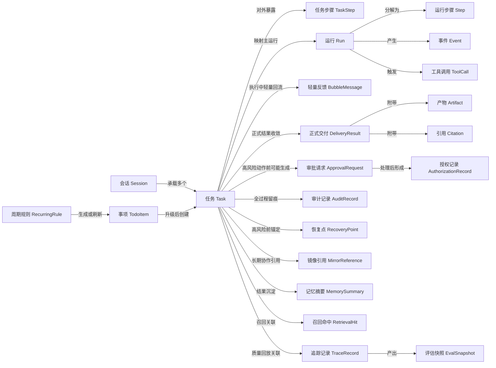
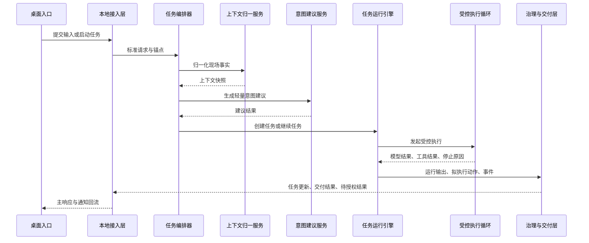
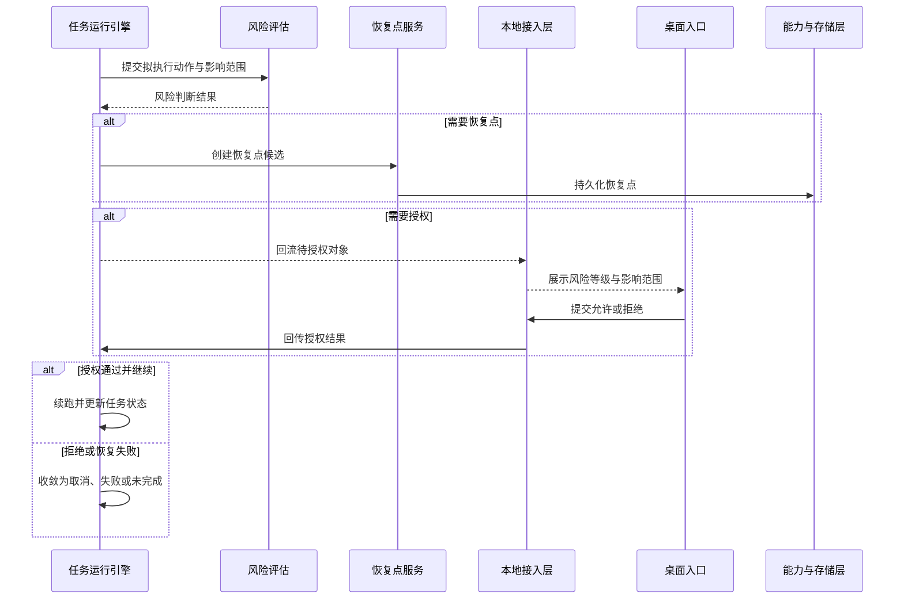
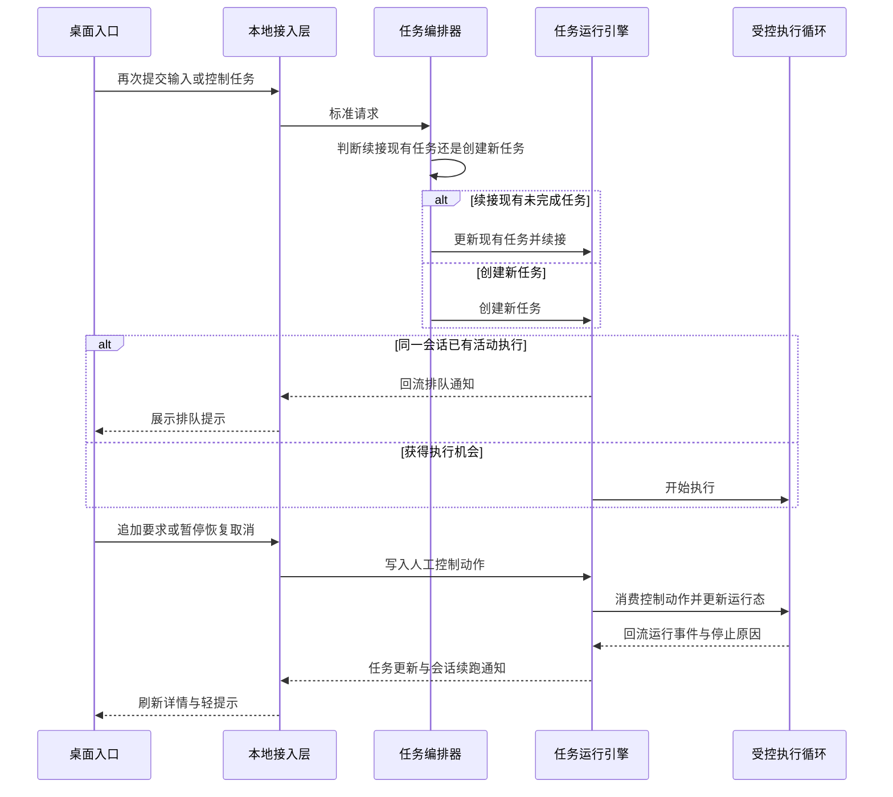
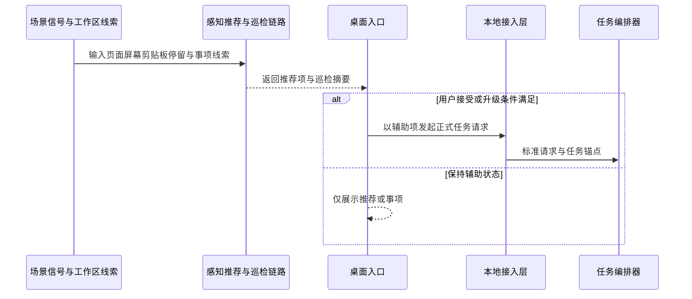
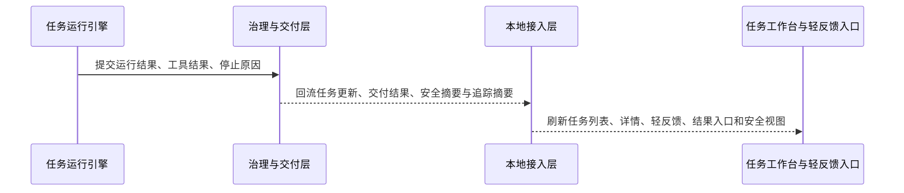

# CialloClaw 架构总览文档

## 1. 文档目的与范围

### 1.1 文档目的

本文档定义 CialloClaw 当前阶段的正式架构基线，用于架构评审、研发对齐、模块详细设计拆分、协议与数据设计回写，以及后续实现验收。

本文档重点回答以下问题：

- 当前系统在产品形态、运行形态和工程形态上的正式边界是什么。
- 系统如何按层分工，层与层之间通过哪些正式对象和正式回流协作。
- 任务如何从桌面现场进入本地 Harness 服务，并被编排、执行、治理、交付和恢复。
- 哪些对象是对外正式对象，哪些对象是后端执行兼容对象，哪些结构只属于运行时协调层。
- 在性能、可靠性、安全治理、可观测性、可扩展性和可维护性方面，系统采用什么架构策略。

本文档定位为“架构总览文档”。它回答系统级分层、对象边界和主链路问题，但不替代协议真源、数据真源和模块实现细节。

### 1.2 文档覆盖范围

本文档覆盖当前正式主链涉及的系统子域和职责边界，重点包括：

- **桌面入口与工作台子域**：负责近场触发、轻量承接、任务工作台、控制入口和状态投影等桌面侧职责边界。
- **本地 Harness 中枢子域**：负责协议接入、任务编排、上下文归一、意图建议、运行控制、会话串行与任务续接等本地主链职责边界。
- **治理与交付子域**：负责风险评估、授权承接、正式交付、审计、恢复、记忆、镜像引用以及 Trace / Eval 的职责边界。
- **能力与存储子域**：负责模型适配、工具路由、插件能力、执行后端、sidecar worker、对象仓储、本地检索、工作区、路径策略和机密存储的职责边界。
- **长期协作与辅助链路子域**：负责推荐、巡检、事项升级、感知信号接入和长期协作能力与主任务链之间的关系边界。

本文档按这些系统子域说明“讨论哪些部分、讨论到什么边界、哪些职责如何协作”，而不把仓库目录和内部包结构当作主叙事对象。

### 1.3 非目标

本文档不展开以下内容：

- 页面级交互细节、动效、按钮行为、视觉样式和产品文案。
- JSON-RPC 方法级字段定义、错误码枚举、通知字段约定和 schema 细节。
- 表结构、索引、DDL、迁移脚本、序列化格式和文件落盘细节。
- 模块内部类图、函数签名、Prompt 细节、工具参数模板与代码级实现。
- CI、Linter、测试策略、提交规范、技能资产管理和排期执行细节。

上述内容分别以下游文档为准：协议设计文档、数据设计文档、模块详细设计文档和工程规范文档。

## 2. 系统定位、问题空间与设计目标

### 2.1 系统定位

CialloClaw 当前是一个 **Windows 优先落地、以本地 Harness 为中枢、以 `task` 为对外主对象组织系统** 的桌面协作 Agent 工程。

从当前仓库和文档基线看，它不是以聊天窗口为中心的通用 AI 客户端，而是由三部分共同组成的本地协作系统：

1. **桌面入口前端**：桌面宿主承接悬浮球近场入口、轻量输入、任务工作台、控制入口和通知投影，让任务可以在当前现场直接发起，也让授权、状态和结果可以以低打扰方式返回用户当前工作流。
2. **本地 Harness 服务**：Go `local-service` 是前后端之间唯一稳定的业务中枢，统一负责 JSON-RPC 接入、任务编排、状态推进、治理回流、结果交付、查询装配和通知重放。
3. **本地能力与存储支撑**：通过模型适配、工具路由、插件接入、执行后端、sidecar worker、SQLite、本地索引、Workspace 与机密存储提供实际执行和持久化能力。

因此，CialloClaw 的系统定位可以归纳为三点：

- **产品上**，它围绕桌面现场和持续任务工作，而不是围绕单一聊天窗口。
- **运行上**，它以 `task` 为对外主对象，以 `run / step / event / tool_call` 作为后端执行兼容链路。
- **工程上**，它是“桌面入口 + 本地接入 + Harness 编排 + 治理闭环 + 能力适配 + 本地存储”的分层系统，而不是单体聊天应用。

补充约束：屏幕分析、错误承接、选区承接、文件拖拽承接等现场型入口，仍然沿同一条 `task-centric` 主链路进入系统，不另立平行架构。

### 2.2 问题空间

CialloClaw 需要解决的不是“用户如何和模型多聊几轮”，而是“用户如何在当前桌面现场直接发起协作，并让系统以可控、可追踪、可恢复的方式完成任务”。

这要求架构同时处理以下问题：

1. **现场承接问题**：输入可能来自选区、页面、报错、拖拽文件、便签事项、历史任务、推荐提示和仪表盘动作，系统必须直接接住这些现场，而不是要求用户先切到聊天页重新组织上下文。
2. **任务持续推进问题**：系统必须围绕 `task` 组织状态、授权、交付和详情视图，而不是围绕一轮轮聊天消息组织状态。
3. **执行安全问题**：文件写入、网页交互、命令执行、依赖安装和工作区外访问等副作用动作必须被风险评估、授权、审计和恢复点机制约束。
4. **结果交付问题**：系统必须支持轻量反馈与正式交付分层，而不是把所有结果都压缩成同一种输出形式。
5. **长期协作问题**：系统需要记忆、推荐、巡检、待办升级和 Trace / Eval 能力，但这些能力不能污染任务主状态机和正式业务真源。
6. **会话连续性问题**：用户在同一桌面现场中的后续补充，有时应续接现有未完成任务，有时应开启新任务；架构必须提供稳定的续接与串行边界，而不是让多个入口无序推进。

### 2.3 架构设计目标

当前架构以以下目标为准：

- 建立以 `task` 为核心对象的统一主链路。
- 保持 `task-centric` 对外语义与 `run-centric` 执行兼容链的稳定映射。
- 让本地 Harness 掌握主状态机，把模型、工具、worker 和插件限制在受控能力层中使用。
- 让风险、授权、交付、审计、恢复、记忆和预算治理成为主链的一部分，而不是外围附属。
- 让桌面入口、本地接入、任务编排与运行、治理交付、能力适配与持久化边界清晰可演进。
- 让运行时事件、结果回流、任务详情和安全摘要围绕同一组正式对象展开。

## 3. 系统边界与设计原则

### 3.1 系统边界

CialloClaw 当前负责以下内容：

- 桌面入口层的任务触发、现场采集与状态投影。
- 本地接入层的 JSON-RPC 接入、Windows Named Pipe 正式链路、调试态 HTTP / SSE 兼容链路、查询装配与通知回流。
- 任务编排、上下文归一化、意图建议、运行控制、Agent Loop、会话串行、会话续接、人工 steer / pause / resume / cancel、推荐和巡检升级。
- 风险判断、审批承接、正式交付、记忆写入、镜像引用、审计留痕、恢复点创建、恢复回流、Trace / Eval 与预算治理。
- 本地优先的结构化存储、索引召回、Workspace、Artifact、机密存储、工具路由、执行后端与 sidecar worker 协作。

当前不负责以下内容：

- 多用户协作与跨设备一致性。
- 云端中心化调度与分布式执行编排。
- 面向第三方开放的平台级插件生态承诺。
- 页面交互动效、视觉规范和组件级状态机设计。
- 以工程治理为中心的流程说明和排期文档替代。

### 3.2 设计原则

架构遵循以下原则：

- **任务中心**：以 `task` 作为正式主对象，而不是聊天轮次或临时会话消息。
- **运行兼容分层**：对外围绕 `task` 组织，对内保留 `run / step / event / tool_call` 以支撑执行、排障和回放。
- **本地优先**：优先在本地完成编排、治理、持久化、索引和恢复。
- **分层清晰**：入口层不做主状态机推进，接入层不做业务决策，能力层不承载产品语义。
- **治理内建**：风险、授权、审计、恢复、Trace / Eval 和预算治理必须能影响主链路，而不只是补日志。
- **正式出口统一**：正式结果必须通过 `BubbleMessage / DeliveryResult / Artifact / Citation` 等正式对象回流，而不是由工具或 worker 直接冒充最终结果。
- **辅助链路分层**：感知、推荐、巡检、记忆和镜像引用服务长期协作，但不能直接改写任务主状态机。
- **不发明未冻结真源**：解释架构时可以使用说明性称谓，但不能把未在当前代码、协议或数据真源中冻结的临时概念写成正式对象。

## 4. 总体架构

### 4.1 总体分层图

### 4.2 主链与反馈链的阅读方式

上图同时表达两类关系：**主执行链** 与 **正式反馈链**。

- **实线**表示主执行链。请求从桌面入口进入本地接入层，再进入任务编排与运行层完成编排与执行，随后进入治理与交付，最终落到正式对象存储与能力后端。
- **虚线**表示正式反馈链。它们不是新的业务主链，而是把授权请求、运行事件、正式结果、恢复结果和状态投影回流到接入层和前端。

当前系统中的正式反馈链至少包括以下类型：

- 审批回流：待授权对象、授权结果、恢复前确认。
- 结果回流：轻量反馈、正式交付、产物入口、引用信息。
- 状态回流：任务更新、运行事件、工具调用完成、会话排队与续跑。
- 安全回流：安全摘要、审计结果、恢复结果、恢复后状态收敛。

反馈链的存在是为了让系统具备“执行中可见、治理中可见、恢复时可见”的能力，但任何反馈都不能绕过 `task` 主对象和正式协议边界，直接形成新的业务状态。

### 4.3 分层职责总览

| 层级             | 典型入站                                 | 典型出站                                                     | 负责内容                                                     | 边界约束                                     |
| ---------------- | ---------------------------------------- | ------------------------------------------------------------ | ------------------------------------------------------------ | -------------------------------------------- |
| 桌面入口层       | 用户动作、桌面现场、通知投影             | 标准 JSON-RPC 请求、授权动作、视图请求                       | 入口触发、现场采集、轻反馈、任务查看和设置入口               | 不做主状态机推进，不直连数据库、模型、worker |
| 本地接入层       | JSON-RPC 请求、治理回流对象、查询请求    | 编排调用、查询结果、事件通知                                 | 方法路由、对象锚定、响应封装、通知重放与查询装配             | 不做任务规划和风险决策                       |
| 任务编排与运行层 | 标准请求载荷、会话锚点、运行控制动作     | `task` 快照、兼容执行对象、治理请求、能力调用请求            | 编排、上下文捕获、意图建议、状态推进、Agent Loop、会话串行与续接、推荐与巡检升级 | 是唯一正式任务中枢                           |
| 治理与交付层     | 运行输出、待执行动作、停止原因、运行事件 | `ApprovalRequest`、`DeliveryResult`、`Artifact`、`AuditRecord`、`RecoveryPoint`、记忆与 Trace 结果 | 风险判断、审批承接、正式交付、审计、恢复、记忆、Trace / Eval | 不新建业务任务，不取代编排器                 |
| 能力与存储层     | 仓储写入计划、能力调用请求、查询请求     | 持久化结果、标准化能力结果、索引命中                         | SQLite / Workspace / Artifact / 索引、模型 / 工具 / 插件、执行与隔离 | 不拥有产品语义，不越层面向前端               |

### 4.4 层间正式交接件

| 上游层           | 下游层           | 正式交接件                                                   | 说明                                           |
| ---------------- | ---------------- | ------------------------------------------------------------ | ---------------------------------------------- |
| 桌面入口层       | 本地接入层       | JSON-RPC 请求载荷、人工动作、视图请求                        | 入口层只传递事实和动作，不附带执行决策         |
| 本地接入层       | 任务编排与运行层 | 标准化请求参数、`session_id`、`task_id`、`trace_id` 锚点     | 接入层负责收口和关联，不改写业务判断           |
| 任务编排与运行层 | 治理与交付层     | 拟执行动作、运行结果、停止原因、运行事件                     | 治理层围绕任务执行结果构造审批、交付和恢复对象 |
| 任务编排与运行层 | 能力与存储层     | 标准化模型 / 工具 / 执行请求、查询请求                       | 上层只通过适配器消费底层能力                   |
| 治理与交付层     | 能力与存储层     | 存储写入计划、artifact 持久化计划、记忆写入计划、恢复点写入  | 治理层不直接写底层实现细节                     |
| 治理与交付层     | 本地接入层       | `ApprovalRequest`、`DeliveryResult`、`Artifact`、`Citation`、安全摘要、恢复结果 | 所有回流对象统一经过接入层再投影到前端         |
| 恢复管理         | 任务编排与运行层 | 恢复结果、续跑信号、恢复后的状态收敛                         | 恢复必须重新并入正式任务主链                   |

### 4.5 跨层约束

- 桌面入口层只处理现场与展示，不理解 `run / step / event / tool_call` 的内部兼容结构。
- 本地接入层可以做方法校验、对象锚定、通知封装和查询装配，但不能承担编排器、风险引擎或运行控制器职责。
- 任务编排与运行层是唯一正式任务中枢；worker、plugin、sidecar 和前端入口都不能自行持有 `task / run` 状态机。
- 治理与交付层必须能真正改变主链，而不是在执行完成后单独补日志。
- 能力与存储层只能提供真源读写和受控能力，不直接形成产品语义，也不直接把底层结果越层推送给前端。
- 任何运行结果、工具结果、恢复结果和推荐升级结果，都必须回到正式对象链后才能决定是否展示、持久化或继续执行。

## 5. 关键架构对象与边界

### 5.1 对外主对象、执行兼容对象与运行时协调结构

当前架构中的对象应按以下边界理解：

| 类型                   | 代表对象                                                     | 架构作用                                                     |
| ---------------------- | ------------------------------------------------------------ | ------------------------------------------------------------ |
| **对外正式对象**       | `Task`、`TaskStep`、`BubbleMessage`、`DeliveryResult`、`Artifact`、`Citation`、`ApprovalRequest`、`AuthorizationRecord`、`AuditRecord`、`RecoveryPoint`、`TodoItem`、`RecurringRule`、`MirrorReference` | 面向前端、协议和工作台的正式对象                             |
| **后端执行兼容对象**   | `Run`、`Step`、`Event`、`ToolCall`                           | 用于执行、排障、回放和运行时事件表达                         |
| **治理与长期协作对象** | `MemorySummary`、`MemoryCandidate`、`RetrievalHit`、`TraceRecord`、`EvalSnapshot` | 服务记忆召回、镜像引用、质量评估与回放                       |
| **运行时协调结构**     | 任务上下文快照、轻量意图建议、任务-运行桥接记录、持久化写入计划、恢复候选 | 仅用于当前实现中的编排、状态推进和持久化协同，不构成新增协议真源 |

除上表中的正式对象外，本文档中出现的“请求载荷”“执行上下文”“能力结果”等词仅用于解释层间交接，不构成新的正式协议对象或数据真源。

补充边界：

- `task` 是对外主对象，前端、任务工作台、安全摘要、正式交付和恢复入口统一围绕 `task_id` 组织。
- `run` 是执行兼容对象，服务于运行时控制、事件回放、排障观察和执行内核，不替代 `task` 成为对外主对象。
- `task` 与其主 `run` 及派生的 `step / event / tool_call` 必须保持稳定映射，任务详情依赖这组对象的投影而不是越层暴露内部结构。

### 5.2 核心对象关系图

该图表达的是一条从“会话承接—任务执行—治理交付—长期协作”的完整对象链：

- `Task` 是对外主对象。前端工作台、任务详情、正式交付、安全摘要和恢复入口都围绕它组织。
- `Run / Step / Event / ToolCall` 是执行兼容链。它们为运行控制、排障、事件回放和工具调用观察服务，不直接替代 `Task` 成为前端主对象。
- `BubbleMessage` 与 `DeliveryResult` 分层存在：前者解决执行中的轻量反馈，后者负责正式交付收敛，并进一步关联 `Artifact` 与 `Citation`。
- `ApprovalRequest / AuthorizationRecord / AuditRecord / RecoveryPoint` 组成治理闭环，确保高风险动作不会绕开审批、审计与恢复约束。
- `MirrorReference / MemorySummary / RetrievalHit / TraceRecord / EvalSnapshot` 组成长期协作与质量回放链，它们与任务主链稳定关联，但不改写任务主状态机。
- `RecurringRule / TodoItem` 属于事项侧对象。事项升级为任务时，会进入新的正式任务链，而不是把事项状态直接混入运行态。

### 5.3 状态边界与辅助链路边界

从架构层看，当前任务状态可分为四组：

- **输入承接态**：围绕输入是否充分、意图是否确认收敛。
- **执行推进态**：围绕正式执行、等待授权、人工暂停、阻塞排队等运行控制阶段收敛。
- **结果收敛态**：围绕完成、失败、取消、未完成收尾等终态收敛。
- **治理投影态**：围绕安全摘要、恢复结果、恢复后状态、审计状态等治理视图收敛。

补充边界：

- `current_step` 和 `current_step_status` 用于表达任务详情中的当前阶段投影，但不替代正式主状态。
- `session_queue`、`human_in_loop`、`waiting_authorization`、`risk_blocked` 等运行控制阶段属于任务详情投影与运行控制语义，不应被提升为新的产品主对象。
- 推荐、巡检、事项和镜像引用默认都不是任务主状态；只有在用户接受或升级条件满足时，才重新进入正式任务入口。
- 同一隐藏会话内，未完成任务可以吸收后续补充输入；但这种“续接”必须由编排层判断并收口，而不是由前端或 worker 直接决定。

## 6. 逻辑分层与协作边界

### 6.1 桌面入口层

#### 6.1.1 职责定位

桌面入口层负责把用户当前桌面现场转换成统一的任务请求，并把后端回流的状态、结果和授权信息投影回桌面界面。它具体承担四类职责：

- 承接近场触发，例如悬浮球点击、选区触发、拖拽文件、错误信息承接、剪贴板承接和快捷入口唤起。
- 组织轻量输入，例如一句话补充说明、简短确认、继续执行、暂停、恢复、取消和授权确认。
- 承载正式查看入口，例如任务列表、任务详情、历史结果、安全摘要、恢复入口和事项入口。
- 维持统一视图投影，把同一条任务在悬浮气泡、工作台和控制入口中的状态表现保持一致。

这一层可以理解当前窗口、选区、拖拽文件、剪贴板和页面停留等“桌面事实”，但不能自行决定任务如何编排、是否续接旧任务、是否需要授权，也不能直接解释 `run / event / tool_call` 级别的内部运行细节。

#### 6.1.2 上下游关系

- 上游是桌面宿主能力和用户当前桌面现场，包括当前窗口、选区、拖拽文件、剪贴板、报错文本和已有任务入口。
- 下游是本地接入层暴露的统一 JSON-RPC 接口，而不是后端模块内部函数。
- 这一层发出的动作主要包括三类：提交新任务、补充现有任务输入、发起查看或控制请求。
- 这一层接收的回流主要包括四类：任务状态更新、正式结果交付、待授权对象、安全与恢复摘要。

#### 6.1.3 关键边界

- 悬浮球、气泡和工作台都不能各自维护一套独立任务状态；展示状态必须以接入层回流的正式对象投影为准。
- 现场采集只能提供事实，不得把“这一定是新任务”或“这一定是旧任务续接”写死在前端。
- 页面停留、截图、选区、拖拽文件和报错承接都必须先经过统一请求收口，不能从前端直接旁路调用模型、worker 或执行后端。
- 入口层可以做交互级去抖、节流、局部 loading 和临时面板状态，但这些局部状态都不能覆盖正式业务状态。

### 6.2 本地接入层

#### 6.2.1 职责定位

本地接入层是桌面端与本地 Harness 服务之间唯一稳定的正式边界，负责三件具体事情：收口协议、锚定对象、回流结果。

- 对所有前端调用统一提供 JSON-RPC 方法入口，并在连接层维持请求响应和异步通知的一致性。
- 把输入绑定到明确的 `task_id`、`session_id`、`trace_id` 等锚点，避免不同入口对同一任务产生不同引用方式。
- 把后端产生的任务更新、待授权对象、交付结果、安全摘要和恢复结果重新装配成前端可直接消费的查询结果和通知。

它不是业务编排层，也不是查询真源层。它的核心价值在于“统一收口”和“统一回流”。

#### 6.2.2 上下游关系

- 上游是桌面入口层发起的输入请求、控制请求、授权请求和查询请求。
- 下游一方面是任务编排与运行层，用于处理创建、续接、控制和执行推进；另一方面是治理与交付层回流的正式对象，用于通知和查询装配。
- 向下游发送的内容不是前端局部状态，而是标准化后的请求参数和对象锚点。
- 向上游回流的内容不是底层原始事件，而是前端可消费的正式对象、聚合查询和稳定通知。

#### 6.2.3 关键边界

- 接入层不能根据页面来源、入口来源或按钮来源自行改写业务含义，例如把“补充输入”直接变成“创建新任务”。
- 接入层不能把 `runengine` 的内部缓存、worker 原始输出或模型 provider 响应直接透传给前端长期消费。
- 所有通知必须从统一回流口发出，不能让 `delivery`、`risk`、`checkpoint`、`agentloop` 等模块各自推送前端。
- Windows Named Pipe 是正式本地 IPC 边界；HTTP / SSE 只用于调试和联调，必须保持相同对象语义与通知语义。

### 6.3 任务编排与运行层

#### 6.3.1 职责定位

任务编排与运行层是系统的主控制层，负责把“一个入口动作”变成“一条受控任务链”。它具体承担六项职责：

- 判断当前输入应该创建新任务、续接旧任务、进入会话排队，还是进入恢复流程。
- 把文本、文件、截图、页面和错误信息归一成可执行的上下文快照。
- 在真正执行前给出轻量意图建议，但保留编排器对主流程的控制权。
- 推进正式任务状态，把运行细节收敛到 `task` 主对象及其运行兼容链的投影上。
- 协调会话串行、人工控制、暂停恢复取消和执行续跑。
- 将推荐、巡检和场景感知等辅助链路接入正式任务入口，但不让它们直接劫持主状态机。

#### 6.3.2 上下游关系

- 上游来自本地接入层，输入包括提交任务、补充输入、人工控制、授权结果、恢复请求和辅助链路升级请求。
- 下游一侧是能力与存储层，具体消费模型适配、工具路由、插件能力、执行后端和对象仓储；另一侧是治理与交付层，提交拟执行动作、运行结果、停止原因和事件。
- 对上游返回的是正式任务视图、运行事件投影和下一步待处理状态，而不是原始模型 token 或 worker 内部过程。
- 对下游提交的是受控执行请求、风险评估输入、交付输入和存储写入计划来源，而不是前端临时状态。

#### 6.3.3 关键边界

- `context` 只负责“把事实收集全”，`intent` 只负责“给出建议”，两者都不能直接改写 `task.status`。
- `runengine` 是唯一正式状态推进点；即便执行发生在 `agentloop`、工具路由或 worker 中，任务状态也必须回到 `runengine` 收敛。
- 会话续接必须以“该任务是否仍可吸收后续输入”为前提；等待授权、人工暂停、恢复处理中或已完成任务不能被隐式续接覆盖。
- 屏幕分析、页面承接、文件拖拽、错误承接和推荐升级都必须进入同一编排器，不允许按入口类型分裂成多套任务状态机。
- 推荐和巡检只负责发现机会或生成候选，不得绕过用户接受和编排器决策直接落成正式任务。

### 6.4 治理与交付层

#### 6.4.1 职责定位

治理与交付层负责把执行结果变成“可继续、可停止、可交付、可审计、可恢复”的正式结果。它具体处理四类关键决策：

- 这一步动作能不能执行，是否需要授权，是否应该先建立恢复点。
- 这次执行结果应该以轻量反馈还是正式交付收敛，是否需要附带产物和引用。
- 这条任务要不要写入记忆、镜像引用、审计和 Trace / Eval。
- 当高风险动作失败或用户请求恢复时，如何把恢复结果重新并入任务主链。

#### 6.4.2 上下游关系

- 上游来自任务编排与运行层，输入包括拟执行动作、工具调用结果、停止原因、正式结果候选和恢复请求。
- 下游一方面落到能力与存储层，写入审批对象、交付对象、产物、审计、记忆和恢复点；另一方面通过本地接入层把待授权对象、交付结果、安全摘要和恢复结果回流给前端。
- 这一层既接收“执行前输入”，也接收“执行后结果”；因此它既参与动作前的拦截，也参与动作后的收敛。

#### 6.4.3 关键边界

- 风险评估发生在高风险动作之前，不能等命令执行或文件落盘之后再补审批。
- `risk` 模块只负责判断，不直接改任务状态；真正进入等待授权、继续执行或终止收敛，必须由编排与运行层接管。
- `delivery` 是正式结果出口，工具原始输出、模型原始回复和 worker 原始日志都不能跳过它直接显示为正式结果。
- 恢复点能力只解决“如何建立恢复锚点”和“如何回流恢复结果”，不应被写成完整的回滚编排器或数据回滚真源。
- 记忆、镜像引用、审计和 Trace / Eval 必须基于正式任务与运行对象建立关联，不能悬空写入。

### 6.5 能力与存储层

#### 6.5.1 职责定位

能力与存储层负责提供可被上层调度的“能力出口”和“真源入口”。它不是产品语义层，但它决定系统有没有稳定的执行基础。具体包括：

- 对象仓储和本地检索，保证任务、交付、治理对象和长期协作对象有稳定真源。
- 模型、工具、插件和 worker 的统一接入，避免上层直接散落依赖 provider SDK。
- 命令执行、浏览器操作、OCR、媒体处理和屏幕分析等高副作用能力的受控执行。
- 工作区、路径策略和机密存储，保证执行边界和敏感信息边界可被约束。

#### 6.5.2 上下游关系

- 上游来自任务编排与运行层、治理与交付层，调用内容包括对象读写、模型调用、工具调用、执行请求、检索请求和恢复点持久化。
- 下游是 SQLite / WAL、本地检索组件、Workspace、Artifact 目录、Secret Store、执行后端以及 Playwright / OCR / 媒体处理 worker。
- 这一层向上游返回的是标准化结果，例如对象写入结果、工具调用结果、执行结果和检索结果，而不是底层实现细节。

#### 6.5.3 关键边界

- 上层只能经由模型适配、工具路由、插件注册和执行后端访问能力，不能直接在业务层绑定 provider SDK 或 worker 协议。
- 数据真源必须统一进入对象仓储，不允许前端、worker 或临时脚本绕过仓储直接改 SQLite 或产物元数据。
- 工作区文件落盘、命令执行成功、浏览器动作完成，都只是“执行结果”，不是“正式业务结果”；是否形成交付必须回到治理与交付层判定。
- 路径策略和机密存储必须先于高风险执行生效，不能把边界检查留到执行完成之后。

### 6.6 跨层协作约束

- **入口层到接入层**：入口层只能提交事实和动作，不能带着“已经决定好的任务结论”进入接入层。接入层必须把来自悬浮球、气泡、工作台和控制入口的请求统一为同一套方法边界。
- **接入层到编排层**：接入层负责传递稳定锚点和标准参数；是否创建任务、是否续接任务、是否进入排队，全部由编排层决定。
- **编排层到治理层**：编排层提交的是拟执行动作、运行结果和停止原因；治理层返回的是审批对象、交付对象、恢复结果和安全摘要。两者不能互相越权：编排层不代替风险判断，治理层不代替状态推进。
- **编排层到能力层**：任何模型调用、工具调用、浏览器操作、OCR 或文件副作用都必须经过能力层适配与执行边界，不能从编排器直接下探到底层 SDK 或 worker。
- **治理层到接入层再到入口层**：待授权对象、正式交付、安全摘要和恢复结果必须先回到接入层，再统一投影给前端，避免不同后端模块对不同入口产生不同口径。
- **长期协作链与主任务链**：推荐、巡检、记忆、镜像引用和 Trace / Eval 都可以围绕任务主链工作，但都不能直接改写任务主状态机；它们只能通过编排升级、交付沉淀或查询投影参与主链。

## 7. 核心链路设计

### 7.1 标准任务创建与执行链路

该链路强调四个关键点：

- 先有正式 `task`，再进入执行。
- `context` 与 `intent` 只做捕获和建议，不直接掌握状态机。
- `runengine` 是正式状态推进点；受控执行循环只是执行分支。
- 正式结果和治理对象必须经由治理层和接入层回流，而不是由执行层直接出现在前端。

### 7.2 授权、恢复点与恢复链路

该链路强调：

- 风险判断先于高风险动作执行。
- 恢复点的职责是准备和表达恢复锚点，而不是独占完整回滚编排。
- 授权结果必须回到 `runengine / orchestrator` 统一推进状态，而不是由前端局部状态直接决定任务结局。

### 7.3 会话续接、串行与人工控制链路

该链路强调：

- 同一会话下的主动执行分支需要被统一协调，而不是允许多个入口或 worker 各自推进。
- steer、pause、resume、cancel 都必须并入 `runengine` 的正式状态控制。
- 会话续接属于编排层能力，既不是纯前端行为，也不是执行层内部私有逻辑。

### 7.4 推荐与巡检升级链路

推荐、巡检和事项默认都不直接进入任务主状态机。只有在用户接受、规则命中或明确升级动作发生后，它们才会先经由本地接入层进入正式请求边界，再并入正式任务链。

### 7.5 结果回流与任务详情刷新链路

该链路强调：

- 任务详情和安全摘要不依赖单一临时响应，而是围绕正式对象和正式事件持续刷新。
- 轻量反馈、正式结果页、Artifact 打开入口和任务详情必须消费同一条正式交付链，而不是各自拼接结果。

## 8. 非功能需求（NFR）

### 8.1 性能与响应

- 近场入口到任务创建必须保持轻量，上下文捕获不应因为过量现场采集而阻塞入口承接。
- 高延迟模型、工具和 worker 调用应通过 `runengine` 异步推进，并及时回流阶段状态。
- 结果交付应区分轻量反馈与正式交付，避免所有结果都等待完整产物落地后才可见。
- 本地接入层应保证同步响应与异步通知的组合体验，减少重复查询和刷新抖动。

### 8.2 可靠性与可恢复性

- `task` 与 `run` 必须稳定映射，任务详情要能定位到最新运行、最新事件和最新工具调用。
- 高风险动作前应优先具备恢复点或明确的不可恢复说明。
- 中断、取消、授权拒绝、恢复失败、会话排队和人工暂停都必须有明确的收敛路径。
- 调试态 HTTP / SSE 与正式 Named Pipe 链路在对象语义和通知语义上必须保持一致。

### 8.3 安全与治理

- 文件写入、命令执行、工作区外访问、依赖安装、敏感路径访问和页面交互等高风险动作必须进入风险评估链。
- 风险判断、审批承接、授权记录、审计留痕和恢复点必须保持对象化，而不是散落在日志中。
- Workspace / Path Policy / Secret Store 必须与普通设置、普通状态和普通文件路径严格分层。
- 预算治理和 provider 降级必须能进入正式主链，并写回审计 / 事件 / Trace 链，而不是只停留在设置项层面。

### 8.4 可观测性与排障

- 任务主对象需要沉淀关键时间点、当前阶段、最近事件、最近工具调用、停止原因和安全摘要。
- `events`、`tool_calls`、`trace_records`、`eval_snapshots` 需要与 `task / run / step` 形成稳定引用关系。
- 运行通知必须支持任务列表、详情、安全摘要、调试视图和恢复入口的统一刷新。
- 任务详情优先围绕正式一等对象和运行时投影构建，而不是依赖单一兼容快照字段。

### 8.5 可扩展性

- 新入口形态应扩展桌面入口层，而不直接侵入 `runengine` 或仓储语义。
- 新能力接入应通过模型 / 工具 / 插件 / worker 适配层暴露，而不直接散布到底层 provider SDK。
- 新治理能力应优先并入正式对象链和正式通知链，而不是在外围再造一套回流机制。
- 新的推荐、巡检或事项升级能力，应优先以辅助链路形式接入，而不是强行改写标准任务主链。

### 8.6 可维护性与真源一致性

- 架构、协议、数据、模块和排期文档必须各自收口，避免一个文档跨层承担所有真源职责。
- 架构总览文档只解释分层、边界和主链，不提前冻结协议字段和落表细节。
- 文档中的正式对象名必须与当前代码、协议和数据真源一致，不得擅自新增未冻结对象名。
- 当代码已经改变主链路、状态机、治理链或正式通知时，必须同步回写相关文档，避免架构基线失真。

## 附录 A：架构到实现的映射

### A.1 关键代码映射

| 架构角色                         | 当前实现线索                                                 |
| -------------------------------- | ------------------------------------------------------------ |
| 桌面入口层                       | `apps/desktop`                                               |
| 本地接入层                       | `services/local-service/internal/rpc`                        |
| 任务编排器                       | `services/local-service/internal/orchestrator`               |
| 上下文归一                       | `services/local-service/internal/context`                    |
| 轻量意图建议                     | `services/local-service/internal/intent`                     |
| 任务运行引擎                     | `services/local-service/internal/runengine`                  |
| 受控执行循环                     | `services/local-service/internal/agentloop`                  |
| 风险评估                         | `services/local-service/internal/risk`                       |
| 正式结果交付                     | `services/local-service/internal/delivery`                   |
| 记忆与镜像引用                   | `services/local-service/internal/memory`                     |
| 审计 / 恢复点 / Trace / Eval     | `services/local-service/internal/audit`、`checkpoint`、`traceeval` |
| 感知 / 推荐 / 巡检               | `services/local-service/internal/perception`、`recommendation`、`taskinspector` |
| 模型 / 工具 / 插件 / 执行 / 平台 | `services/local-service/internal/model`、`tools`、`plugin`、`execution`、`platform` |
| 持久化与索引                     | `services/local-service/internal/storage`                    |
| sidecar worker                   | `workers/*`                                                  |

### A.2 当前实现对齐约束

- 上下文模块的稳定输出是任务上下文快照；其职责是把输入与现场事实归一化，而不是在接入层或执行层分散理解上下文。
- 意图模块当前仍是轻量建议层；其产物是轻量意图建议，不直接推进状态机，也不替代编排器。
- 任务运行引擎维护任务与运行态之间的桥接记录，用于连接对外 `task` 语义与内部 `run` 执行状态。
- `agentloop.Runtime` 是受控执行分支，负责输出 `loop.*` 生命周期事件、工具调用结果和停止原因，但不是系统总编排器。
- `risk.Service` 只负责输出稳定、可测试的风险判断结果；正式审批对象和状态迁移由上层编排与运行控制协同完成。
- `checkpoint` 模块定位为恢复点能力的最小收口层，而不是独占回滚编排器或文件恢复执行器。
- `recommendation`、`taskinspector` 和 `perception` 已形成辅助链路能力，但默认不直接写入任务主状态机；升级为正式任务时仍需重新进入统一任务入口。
- 本地接入层同时保留 Windows Named Pipe 正式链路与调试态 HTTP / SSE 兼容链路；后者不改变正式对象语义。
