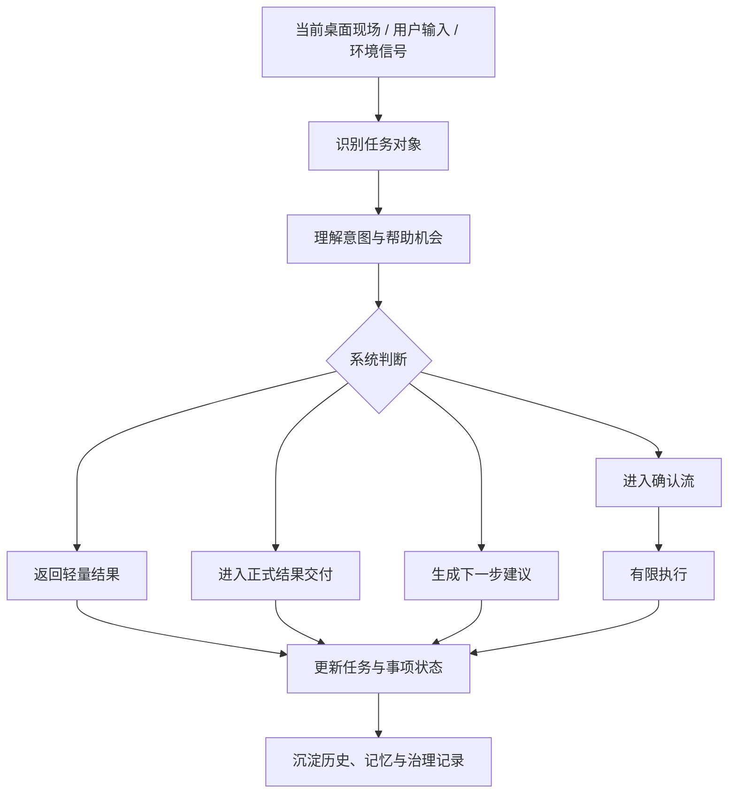

# CialloClaw 产品需求文档（PRD）

| 文档信息 |                        |
| -------- | ---------------------- |
| 产品名称 | CialloClaw             |
| 文档版本 | v3.5                   |
| 文档状态 | 整理版                 |
| 创建日期 | 2026-04-14             |
| 目标平台 | Windows / macOS 桌面端 |
| 产品定位 | 桌面常驻协作型 Agent   |

------

## 1. 项目背景

当前桌面端用户在真实工作流中使用 Agent 时，长期存在三类未被良好满足的问题：

**问题 A —— Agent 发起门槛高：**
用户通常需要先打开聊天窗口、进入某个工作区或组织 prompt，系统才开始理解需求。很多“本可以顺手发起”的帮助，最终因为路径太长而没有发生。

**问题 B —— 上下文迁移成本高：**
用户需要手动复制网页、文档、报错、文件内容，再搬运到另一个产品中让 Agent 理解。帮助发生在任务现场之外，而不是围绕现场直接展开。

**问题 C —— 执行不可信、长期价值不可见：**
很多 Agent 可以给建议，但用户不敢交出执行权，因为不清楚它会改什么、保存到哪里、失败后能否恢复、为什么需要授权。同时，系统即便记住了偏好，也常以黑箱方式存在，难以形成长期协作信任。

**市场机会：**
当前聊天型 AI 擅长问答，但不自然嵌入桌面任务现场；自动化工具能做事，但学习成本高、交互生硬；桌面小组件有入口，却缺乏持续协作能力。CialloClaw 希望填补这几类产品之间的空白：既不要求用户离开当前工作流，又能在可控边界内帮助理解、提醒、推进与有限执行。

**产品机会：**
用户真正需要的，不是一个“必须专门去使用”的 AI 工具，而是一个“在当前桌面现场中顺手出现、顺手帮忙、不会乱来”的协作对象。只要产品能同时解决“发起门槛、上下文承接、结果可消费、边界可理解”四个问题，就有机会形成长期使用习惯。

------

## 2. 项目目的

打造一款**面向真实桌面任务现场的常驻协作型 Agent 产品**，让用户在日常使用电脑时拥有一个：

- 不必先进入聊天窗口即可发起协作的桌面入口
- 能围绕当前页面、文件、文本、任务和异常现场提供帮助的上下文助手
- 能从“理解内容”推进到“给出下一步、生成草稿、推动事项”的协作对象
- 能在明确边界内执行有限动作，并让用户清楚知道影响范围、恢复方式与资源消耗的可信系统

补充原则：

- 默认常驻，按需展开
- 通话优先，文字补充
- 上下文优先，聊天后置
- 先提示，再确认，后执行
- 高风险动作必须可控
- 开箱即用优先

------

## 3. 项目目标

### 3.1 产品目标

#### 目标一：降低桌面协作发起门槛

用户应能够通过单击、长按、悬停、拖拽、选中等轻动作，在当前桌面现场顺手发起一次协作，而不是先打开另一个产品再组织需求。

#### 目标二：让帮助直接发生在任务现场

系统应优先围绕当前页面、文本、文件、视频、错误信息、任务事项等上下文承接需求，减少复制粘贴、切换工具和解释背景的成本。

#### 目标三：从“回答问题”走向“推进任务”

CialloClaw 不只负责给出解释和总结，还应帮助用户明确下一步、生成草稿、打开资料、推动事项进入执行，并在必要时把未来安排转化为正在推进的任务。

#### 目标四：建立长期协作与可控执行信任

系统应逐步形成对用户偏好、习惯、任务脉络的长期理解，并通过风险分级、授权确认、日志、恢复点、资源消耗可见等能力，建立“敢用、敢托付一点事”的信任基础。

### 3.2 用户价值目标

| 目标维度   | 目标说明                                     |
| ---------- | -------------------------------------------- |
| 发起效率   | 用户在当前桌面现场发起协作的成本明显降低     |
| 上下文效率 | 用户补充背景与搬运内容的成本明显下降         |
| 推进效率   | 用户从“知道问题”到“进入下一步动作”的路径缩短 |
| 信任感     | 用户能理解系统边界、恢复方式和资源消耗       |
| 长期协作   | 用户能感知系统记住了什么，并从中获得持续价值 |

### 3.3 产品成功标准

从最终产品视角，CialloClaw 需要稳定达成以下主观结果：

- 它总是在，但不烦
- 我不必先去打开它，它就在当前任务附近
- 它能看懂我正在做什么，不必让我重复解释
- 它不只是说建议，还会帮我推进下一步
- 它做事之前会让我明白边界
- 我能知道它做了什么、花了什么、出了问题怎么退
- 它越来越像一个熟悉我工作方式的协作者

------

## 4. 功能清单

### 4.1 用户需求及对应功能点

| 用户需求                                           | 对应功能点                                    | 优先级 |
| -------------------------------------------------- | --------------------------------------------- | ------ |
| 在当前页面、文本、文件上快速获得帮助               | 内容理解、总结、翻译、解释、重点提炼          | P0     |
| 遇到报错、阻塞或异常时获得原因和下一步建议         | 异常理解、任务推进建议、阻塞解释              | P0     |
| 把未来要做的事情整理起来，并在合适时机被提醒或推进 | 便签协作、临期识别、重复事项、Agent 建议      | P0     |
| 把某件事项正式交给 Agent 推进                      | 便签转任务、任务状态模块、任务详情            | P0     |
| 了解当前任务做到哪一步、是否卡住、是否需要授权     | 任务状态模块、进度时间线、信任摘要            | P0     |
| 希望系统越来越懂自己，但又不想被黑箱记住           | 镜子模块、历史概要、用户画像、记忆管理        | P0     |
| 希望清楚知道系统会改什么、影响什么、能不能撤回     | 安全卫士、风险分级、恢复点、审计记录          | P0     |
| 需要一个稳定的桌面入口，而不是聊天窗口             | 悬浮球、气泡区与轻量输入、仪表盘              | P0     |
| 希望能启用或关闭主动协助、记忆、预算等全局行为     | 控制面板、记忆策略、主动协助、预算设置        | P1     |
| 希望系统支持更多自动化与扩展能力                   | 自动化设置、平台扩展、模型路由、插件 / Skills | P2     |

### 4.2 功能模块总览

| 功能模块           | 功能项                                               | 优先级 |
| ------------------ | ---------------------------------------------------- | ------ |
| 悬浮球             | 常驻入口、状态提示、单击 / 双击 / 长按 / 悬停承接    | P0     |
| 气泡区与轻量输入   | 短结果、轻提示、补充输入、意图确认                   | P0     |
| 内容理解           | 总结、翻译、解释、错误分析、重点提炼                 | P0     |
| 任务推进           | 下一步建议、草稿生成、资料入口、阻塞解释             | P0     |
| 仪表盘首页         | 首页焦点区、任务总览、首页优先级召回入口             | P0     |
| 任务状态模块       | 进行中 / 等待中 / 异常中 / 已结束任务查看与管理      | P0     |
| 便签协作模块       | 近期要做、后续安排、重复事项、已结束事项             | P0     |
| 镜子模块           | 历史概要、阶段总结、用户画像、记忆管理               | P0     |
| 安全卫士模块       | 风险分级、待确认项、授权记录、恢复与费用             | P0     |
| 控制面板           | 全局行为、记忆策略、主动协助、预算与默认结果位置设置 | P1     |
| 自动化与扩展       | 周期巡检、定时任务、插件 / Skills、模型路由          | P2     |
| 高阶理解与能力扩展 | 视频总结、长内容理解、多模型协同                     | P2-P3  |

### 4.3 优先级说明

本节不重复列出具体功能清单，而用于说明本文档为何采用当前优先级划分方式，以及不同优先级背后的判断标准。

**优先级划分原则：**

1. **是否直接影响主链路成立**  
   优先保证用户能够完成“发起协作 → 获得结果 → 继续推进任务”的完整闭环。凡是直接决定主链路能否成立的能力，应优先进入更高优先级。

2. **是否决定产品的第一认知与第一体验**  
   用户首次接触产品时，最先感知到的是入口是否自然、反馈是否及时、当前状态是否清楚。因此，直接影响首轮体验与产品成立感的能力，应优先保障。

3. **是否承担系统级承接职责**  
   某些模块虽然不是单点功能，但承担统一承接、统一聚合、统一管理的作用。这类能力会影响整体结构稳定性，因此优先级通常高于纯增强型能力。

4. **是否属于增强理解、增强治理或增强个性化能力**  
   这类能力能够显著提升长期价值，但不会阻断产品最小闭环成立，因此可以放在主链路之后，按阶段逐步完善。

5. **是否依赖更复杂的系统能力或更高实现成本**  
   涉及自动化、多模型协同、复杂执行、长内容理解等能力，往往依赖更高的工程复杂度、治理成本或验证周期，因此应后置处理。

**各优先级的含义：**

- **P0**：用于保证产品最小可用闭环成立，是首版必须具备的能力。
- **P1**：不决定首版是否可用，但会显著影响管理体验、长期协作体验与系统可控感。
- **P2**：属于效率增强或扩展能力，应在核心体验稳定后逐步引入。
- **P2-P3**：属于高阶能力探索，更多服务于差异化提升与长期演进，不应抢占首版资源。

### 4.4 核心功能逻辑

CialloClaw 的核心运行逻辑可归纳为一条统一的“**现场识别 → 理解判断 → 结果交付 → 任务推进 → 长期沉淀**”链路：

**关键设计决策：**

- 产品主入口是悬浮球，而非聊天窗口
- 轻量结果优先在当前任务现场附近交付，长结果自动分流至正式交付层
- “便签协作”与“任务状态”严格区分：前者是未来安排，后者是已被 Agent 接手推进的工作
- 高风险动作必须进入确认流，不允许以黑箱方式直接执行
- 长期记忆必须对用户可见、可管理、可纠正

------

## 5. 通用规则

### 5.1 全局运行策略

| 场景         | 策略                                                       |
| ------------ | ---------------------------------------------------------- |
| 默认状态     | 产品以低存在感方式常驻，可随时接近，但不持续抢占注意力     |
| 用户主动发起 | 优先围绕当前对象承接，先给短结果或意图确认，再进入正式交付 |
| 系统主动协助 | 仅以轻提示方式出现，不使用高侵入打断                       |
| 长结果生成   | 自动分流到文档、结果页、任务详情等正式交付层               |
| 风险动作     | 统一进入风险分级和授权确认链路                             |
| 中断与失败   | 必须告诉用户卡在哪一步、是否有恢复点、能否重试             |

### 5.2 文案展示通用规则

| 规则项       | 说明                                           |
| ------------ | ---------------------------------------------- |
| 表达风格     | 以任务导向、清晰、可理解为主，避免抽象系统术语 |
| 结果长度     | 轻量结果应控制在一屏内；超出必须自动分流       |
| 推荐语句     | 必须短、直接、可点击，不应写成长解释           |
| 风险说明     | 必须具体说明会改什么、影响什么、能否撤回       |
| 主动提示频率 | 必须克制，避免在用户无操作或离开时高频打扰     |

### 5.3 名称定义说明

以下术语为正式命名。括号仅在首次出现时用于术语映射或能力澄清，后续正文不重复使用解释性括号。

| 术语         | 定义                                                           |
| ------------ | -------------------------------------------------------------- |
| 悬浮球       | 桌面常驻入口，用户接近 CialloClaw 的默认近场入口               |
| 气泡区       | 当前任务现场附近的短结果、轻提示与状态反馈承接层               |
| 轻量输入     | 围绕当前对象的一句话补充输入与意图确认入口                     |
| 仪表盘       | 承载首页、高价值信息球、任务状态、便签协作、镜子、安全卫士的统一工作台 |
| 控制面板     | 低频全局设置与系统策略入口，不承担任务承接与结果查看职责       |
| 任务         | 已经被 Agent 接手并正在推进的工作                              |
| 便签协作     | 未来安排、周期事项和可转交给 Agent 的异步协作入口              |
| 镜子         | 系统对历史、偏好、总结和长期理解的显性表达层                   |
| 安全卫士     | 风险、授权、恢复、审计、成本的解释与接管层                     |
| 高价值信息球 | 仪表盘首页中的优先级召回机制，用于提示当前最值得关注的信息     |
| 正式交付     | 文档、结果页、任务详情、文件等可继续消费和回看的结果           |

------

## 6. 需求详情说明

### 模块 1：悬浮球与气泡区

**系统映射：**

- 悬浮球：默认常驻近场入口
- 气泡区与轻量输入：短结果、确认、补充输入承接

**模块定位：**
悬浮球与气泡区共同构成桌面近场交互层。它们负责让协作在当前任务附近被低成本发起、低打扰承接，而不是让用户先打开一个聊天窗口再组织需求。

**用户可见能力：**

- 提供可随时接近的常驻入口
- 展示当前系统主状态
- 承接用户单击、双击、长按、悬停、拖拽、文本选中后的后续动作
- 在识别到帮助机会时，以低打扰方式提示用户
- 显示短结果、状态反馈、下一步建议与意图确认
- 承接一句话补充输入

**核心交互：**

| 交互行为 | 系统响应                                         |
| -------- | ------------------------------------------------ |
| 单击     | 轻量接近；若已有任务对象，则进入围绕该对象的承接 |
| 双击     | 打开仪表盘                                       |
| 长按     | 进入语音承接                                     |
| 悬停     | 展示轻量输入与推荐问题                           |
| 文件拖拽 | 识别文件对象并进入确认流                         |
| 文本选中 | 标记为已识别对象，等待用户继续发起               |

**设计原则：**

- 单击用于低成本发起协作，不是默认打开应用
- 长按是语音主入口，上滑锁定、下滑取消
- 悬停用于一句话补充和推荐问题，不演化为聊天弹窗
- 文本选中与文件拖拽的目标，是让任务对象直接进入协作链路，而不是让用户先复制粘贴到对话框中
- 轻量承接默认轻量，不演化为聊天窗口
- 生命周期可控，可隐藏、恢复、置顶、删除
- 一旦内容超出承载范围，必须自动分流到正式交付层

### 模块 2：仪表盘

**系统映射：** 统一工作台，承接首页、高价值信息球、任务状态、便签协作、镜子与安全卫士

**模块定位：**
仪表盘是产品的统一工作台。它不是单一页面，而是用户查看当前进展、理解系统状态、管理异步协作、回看长期沉淀以及处理风险确认的主阵地。所有需要“回看、管理、判断、接管”的内容，都应收口到仪表盘内部完成。首页与任务状态属于主链路优先级，镜子、安全卫士增强项与高价值召回机制可按阶段逐步完善。

**仪表盘整体职责：**

- 聚合当前最值得关注的信息
- 统一承接任务、事项、记忆与安全治理信息
- 让用户在一个工作台内完成查看、确认、调整与接管
- 提供从首页预览到详情管理的清晰层级
- 避免各模块分散漂浮，降低理解和操作成本

#### 2.1 仪表盘首页与高价值信息球

**系统映射：** 仪表盘首页焦点区 / 首页召回提示机制

**定位说明：**
仪表盘首页负责在用户打开产品后第一时间回答三个问题：现在最该看什么、哪里需要我介入、哪些事情可以继续推进。高价值信息球从属于首页焦点区，是首页的优先级召回机制，而不是独立一级业务模块。

**首页应承载的内容：**

- 当前最值得优先关注的信息
- 关键任务的简要状态
- 待确认或待处理事项摘要
- 最近一次重要产出或异常摘要
- 进入详情页的明确入口

**高价值信息球展示内容：**

- 简略的事件描述
- 简略的任务执行状态
- 查看详情的提醒
- 取消或稍后处理入口

**设计要求：**

- 必须从属于仪表盘首页，不独立成新的业务层
- 不与首页焦点区、任务状态卡片重复造层
- 用于召回最值得先看的内容，而不是承接完整详情
- 页面语言必须帮助用户快速判断“是否需要立即处理”

#### 2.2 任务状态模块

**系统映射：** 仪表盘中的任务状态工作区

**模块定位：**
任务是“已经被 Agent 接手并正在推进的工作”；便签协作中的事项是“未来的安排”。当便签协作中的某件事正式交给 Agent 推进后，应自动生成一个任务，并与原始事项保持关联。

**预览态要承载的内容：**

未完成任务至少展示：

- 任务名称
- 任务状态
- 当前执行到哪一步

已结束任务至少展示：

- 任务名称
- 最终状态

首页焦点区必须让用户快速判断：

- 这个任务是否卡住
- 是否需要我现在介入
- 当前是否接近完成

**详情态要承载的内容：**

- 任务头部：任务名称、当前状态、来源、开始时间、最近更新时间
- 进度时间线：完整步骤、当前停留步骤、已完成 / 进行中 / 未开始的清晰区分
- 关键上下文：资料、记忆摘要、用户约束、重要前提
- 成果区：文件、草稿、网页、清单、模板等，并支持直接打开
- 信任摘要：风险状态、待授权数量、恢复点、最近边界触发
- 操作区：暂停 / 继续、取消、修改任务、查看安全详情、重启任务

**建议采用的状态语言：**

- 进行中：正在进行、接近完成
- 等待中：暂停、等待授权、等待补充信息、等待上游条件
- 异常中：失败、阻塞、执行异常
- 已结束：已完成、已取消、已结束未完成

#### 2.3 便签协作模块

**系统映射：** 仪表盘中的便签协作工作区

**模块定位：**
便签协作不是传统待办清单，而是 Agent 异步协作的入口。它负责把“记下来的事情、周期性的事情、尚未开始但需要记住的事情”整理成可巡检、可提醒、可转交给 Agent 的结构。

**分类结构与预览逻辑：**

- 近期要做：快到时间、今天要做、最近几天要处理的事项
- 后续安排：已记下但还没到处理窗口的事项
- 重复事项：每天、每周、每月等循环发生的规则
- 已结束：已完成或已取消的事项

**Agent 建议的表现方式：**

- 下一步建议：先打开模板、先整理材料、先生成草稿等
- 待办转任务：用户确认后，直接生成任务并跳转到任务状态页
- 流程化建议：反复延期或频繁出现时，提示整理成固定流程或模板

#### 2.4 镜子模块

**系统映射：** 仪表盘中的镜子工作区

**模块定位：**
镜子模块承接的是 Agent 的长期理解能力，但页面表现不能像原始日志仓库，而应像“可以被用户理解和管理的认知镜像”。

它至少要承担三件事：

- 替代传统聊天中的历史承接，让用户能看到最近一段时间的对话概要与上下文脉络
- 生成日报或阶段总结，让用户知道今天做了什么、完成了什么、涉及了哪些关键权限或成果
- 逐步沉淀用户画像、偏好与习惯，并允许用户查看、纠正、关闭或删除

**可管理动作：**

- 保留
- 修改
- 删除
- 忽略本次建议
- 关闭该类记忆

**补充要求：**

- 记忆默认以结构化信息为主，不以原始文本堆积为目标
- 支持短期记忆、长期记忆、任务级记忆分层
- 周期性总结要对用户可见、可验证、可管理

#### 2.5 安全卫士模块

**系统映射：** 仪表盘中的安全与治理工作区

**模块定位：**
安全卫士是仪表盘里的最后一道解释与接管层。它不应该只在出事时出现，而应始终让用户知道：

- 当前有没有待确认操作
- 最近是否发生过拦截
- 成果会保存到哪里
- 如果现在停下能否恢复

**预览态至少展示：**

- 当前安全状态
- 待确认操作数
- 最近一次异常
- 最近恢复点
- 当前任务资源消耗
- 今日累计资源消耗

**详细态包含：**

- 待确认 / 被拦截操作
- 授权记录
- 审计记录
- 影响范围
- 恢复与回滚
- 规则与权限管理
- Token 与费用
- 执行日志

**风险等级的页面表达：**

- 绿灯：低风险、可静默执行，页面记录即可
- 黄灯：会修改内容或改变环境，先解释影响范围，再给确认入口
- 红灯：删除、外发、不可逆、越界或涉及身份与关键文件的动作，必须显式人工确认

**补充边界能力：**

- 默认工作区与写入边界校验
- 高风险执行进入更强隔离环境
- 一键中断与恢复
- 任务工作区级回滚与项目级快照恢复的预留设计

### 模块 3：控制面板

**系统映射：** 全局设置与系统策略入口

**模块定位：**
控制面板是 CialloClaw 的低频配置入口，用于承接全局行为、默认偏好和系统维护相关设置，不承担任务承接与结果查看职责。

**负责内容：**

- 桌面入口行为
- 主动协助与感知开关
- 记忆启用与生命周期
- 自动化与巡检基础设置
- 默认结果位置
- 成本与预算设置
- 数据清理与恢复默认

**设计原则：**

- 低频使用
- 不打扰主流程
- 与仪表盘职责分离
- 高风险设置需明确确认

### 模块补充：系统能力说明

以下能力不作为独立一级页面模块存在，但会贯穿悬浮球、气泡区、正式交付层与仪表盘各处：

| 能力项       | 作用说明                                                   |
| ------------ | ---------------------------------------------------------- |
| 内容理解     | 负责总结、翻译、解释、重点提炼、错误分析等基础理解能力     |
| 任务推进     | 负责下一步建议、草稿生成、资料打开、阻塞解释和推动事项继续前进 |
| 长期记忆     | 负责偏好沉淀、上下文继承、镜子内容生成与任务级记忆承接     |
| 执行与自动化 | 负责确认后执行、周期巡检、自动化任务、插件 / Skills 扩展   |
| 安全与治理   | 负责风险判断、授权确认、恢复回滚、审计与成本治理           |

------

## 7. 效果评估与数据统计

### 7.1 核心数据看板

| 数据指标       | 统计维度     | 采集方式                       |
| -------------- | ------------ | ------------------------------ |
| 悬浮球交互率   | 日 / 周 / 月 | 单击、长按、悬停、拖拽等事件   |
| 任务发起率     | 日 / 周      | 协作任务创建事件               |
| 任务完成率     | 日 / 周      | 任务状态流转事件               |
| 任务推进率     | 周           | 获得结果后继续下一步动作的比例 |
| 便签转任务率   | 周           | 事项正式交给 Agent 推进的比例  |
| 主动提示接受率 | 周           | 主动提示点击 / 展示            |
| 镜子模块回看率 | 周 / 月      | 镜子模块访问事件               |
| 待确认处理率   | 日 / 周      | 待确认项被处理的比例           |
| 恢复点使用率   | 周 / 月      | 恢复动作事件                   |
| 资源消耗可见率 | 周           | 用户查看成本 / 预算信息的比例  |

### 7.2 核心验证指标

| 目标维度 | 指标                                           | 判断方向               |
| -------- | ---------------------------------------------- | ---------------------- |
| 发起效率 | 文本选中后继续协作率、文件拖拽发起率           | 验证入口是否自然       |
| 协作效率 | 任务完成率、任务推进率                         | 验证是否不只停留在回答 |
| 长期价值 | 镜子回看率、个性化结果认可度                   | 验证长期协作是否成立   |
| 信任治理 | 高风险确认通过率、恢复点使用率、风险可控感评分 | 验证是否建立信任       |

补充建议指标：

- 长按通话率
- 双击打开仪表盘率
- 主动提示后继续协作率
- 单任务平均 Token / 成本
- 中断后恢复率

------

## 8. 性能与安全性等非功能性需求

### 8.1 性能要求

| 指标           | 目标要求                             |
| -------------- | ------------------------------------ |
| 悬浮球可接近性 | 应始终快速可触达，不可因复杂状态阻塞 |
| 轻量反馈速度   | 应尽可能即时出现                     |
| 长任务反馈     | 必须明确展示处理中状态               |
| 结果分流体验   | 长结果不得阻塞气泡区与轻量输入       |
| 仪表盘理解效率 | 用户打开后 10 秒内应能定位最重要信息 |

### 8.2 安全性要求

| 安全领域 | 具体要求                                     |
| -------- | -------------------------------------------- |
| 风险控制 | 高风险动作必须进入确认流                     |
| 边界管理 | 系统必须明确说明会改什么、影响什么、能否撤回 |
| 审计能力 | 重要动作必须可查、可追踪                     |
| 恢复能力 | 中断和失败后必须提供恢复或回退信息           |
| 成本透明 | 当前任务与今日累计资源消耗必须可见           |
| 记忆管理 | 用户必须可查看、删除、关闭或纠正长期记忆     |

### 8.3 可用性要求

| 场景               | 处理方式                                               |
| ------------------ | ------------------------------------------------------ |
| 用户不想被打扰     | 主动协助可关闭，且支持免打扰策略                       |
| 用户看不懂系统状态 | 首页、仪表盘首页召回提示和任务卡必须用直白状态语言表达 |
| 任务被阻塞         | 必须明确说明缺什么、卡在哪，而不是只显示失败           |
| 任务完成           | 必须能直接看到成果、打开结果或进入下一步               |
